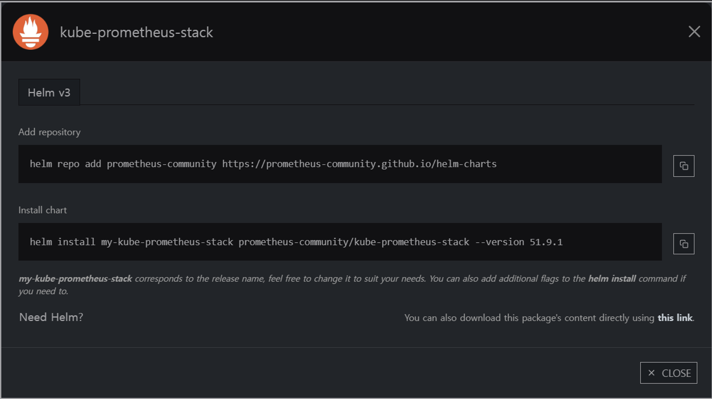
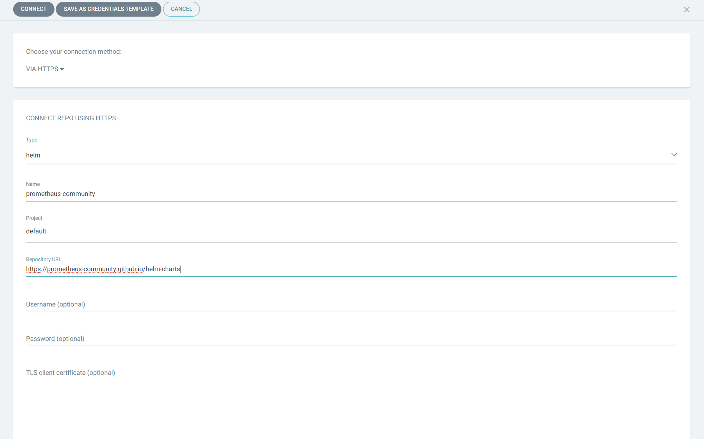
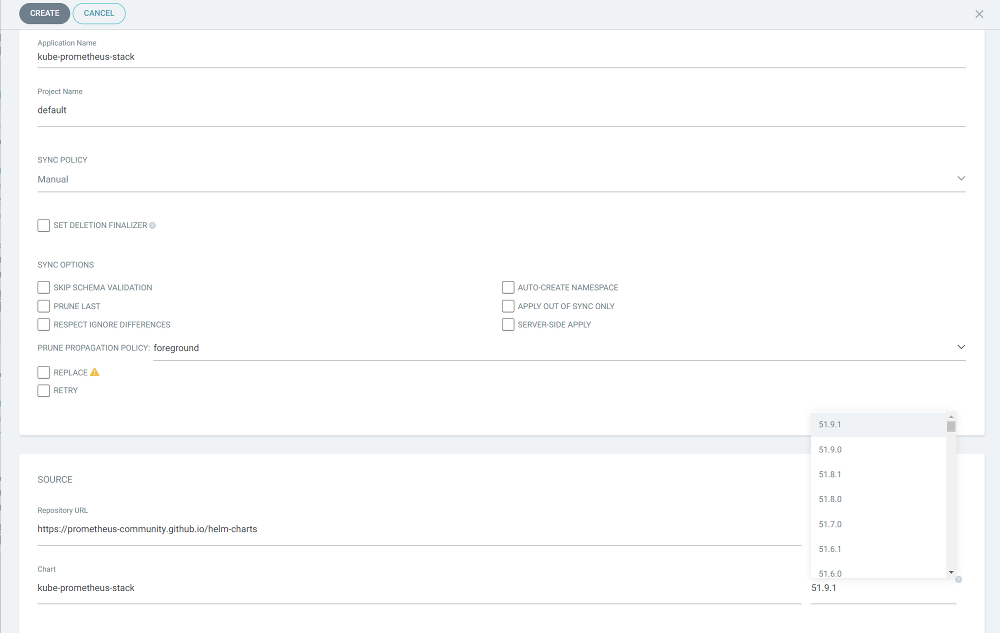
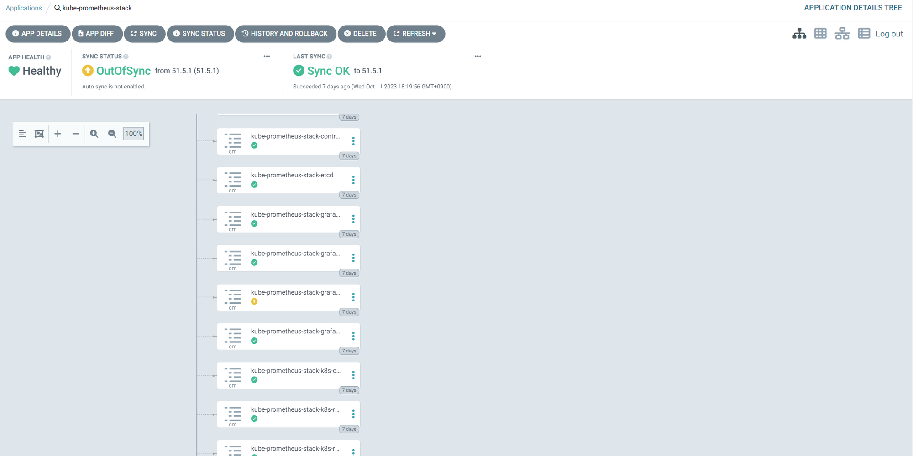
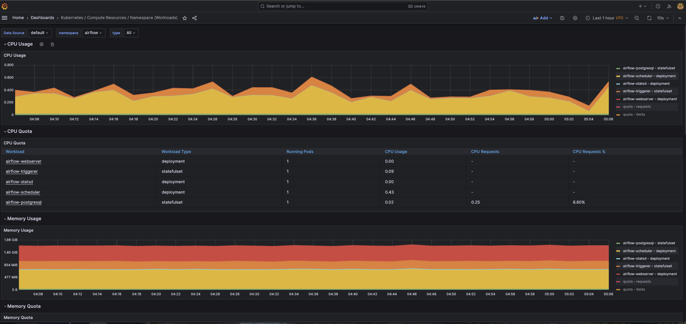

# Promethues

Helm Chart 배포



```yaml
https://prometheus-community.github.io/helm-charts
kube-prometheus-stack
```

argo Repo 등록



app 생성



storageSpec: {}를 정의하여 prometheus에 로그를 저장할 수 있다.

기본 값은 emptyDir로 deployment가 삭제되면 로그가 사라진다.

사용한 values 값

```yaml
grafana:
  persistence:
    enabled: true
    size: 10Gi
  adminPassword: qwer1234!
  ingress:
    enabled: true
    ingressClassName: nginx
    annotations: 
      cert-manager.io/issuer: letsencrypt-prod
    labels: {}
    hosts: 
      - grafana.srrain.kro.kr
    path: /

    tls: 
      - secretName: grafana-general-tls
        hosts:
        - grafana.srrain.kro.kr

  #datasource에 pvc가 안 붙어 있어서 휘발되기에 미리 정의
  additionalDataSources: 
  - name: Tempo
    type: tempo
    typeName: Tempo
    access: proxy
    url: http://tempo.grafana.svc:3100
    password: ''
    user: ''
    database: ''
    basicAuth: false
    isDefault: false
    jsonData:
    nodeGraph:
      enabled: true
    tracesToLogs:
      datasourceUid: loki
      filterBySpanID: false
      filterByTraceID: true
      mapTagNamesEnabled: false
      tags:
          - compose_service
    readOnly: false
    editable: true
  - name: loki
    type: loki
    uid: 
    url: http://loki-distributed-gateway.grafana.svc
    access: proxy
    basicAuth: false
    jsonData:
      serviceMap:
        datasourceUid: 'prometheus'

prometheus:
  prometheusSpec:
    additionalScrapeConfigs:
      - job_name: 'otel-collector'
        scrape_interval: 10s
        static_configs:
          - targets: ['otel-collector.otel.svc:8889']
          - targets: ['otel-collector.otel.svc:8888']
    #Tempo에서 Service Graph 그리기 위해 외부 접근 활성화
    enableRemoteWriteReceiver: true
    # dashboard가 휘발성이라 pvc mount
    storageSpec:
      volumeClaimTemplate:
        spec:
          accessModes: ["ReadWriteOnce"]
          resources:
            requests:
              storage: 30Gi
```

### —이슈—

Custom Resource Definition이 생성될 때

annotations이 너무 길면 kubectl apply가 정상적으로 작동하지 않는다.

argo는 apply를 통해 sync를 하기에 에러가 발생하는데 sync 옵션으로 해결이 가능하다.



sync 버튼에서 REPLACE를 활성화하여 sync를 작동하면

kubectl apply가 아닌 kubectl create로 동작하기 때문에 정상적으로 argo App에 등록할 수 있다.


Pod의 리소스 지난 사용량을 볼 수 있다.
