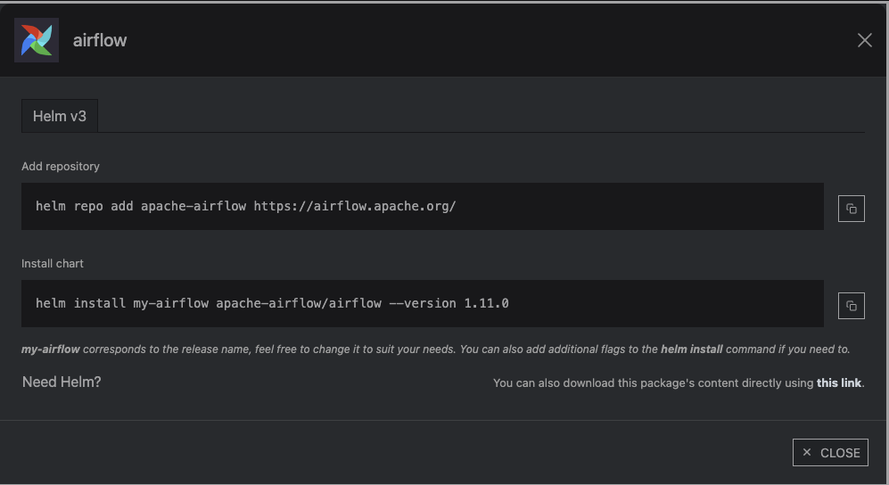
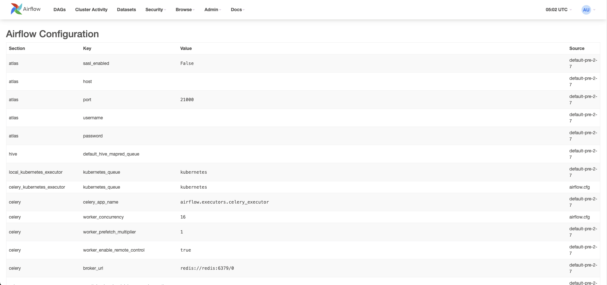

# airflow

k8s기준으로

https://artifacthub.io/packages/helm/apache-airflow/airflow 에서 명령어로 설치할 수 있다



`helm repo add apache-airflow https://airflow.apache.org/`

`helm install my-airflow apache-airflow/airflow --version 1.11.0`

사용한 values값 

values.yaml 오버라이드해서 설치하는 명령어

`helm install airflow apache-airflow/airflow --version 1.11.0 -f {파일명}` 

```yaml
#여기는 argocd에서 등록할 때 helm install과 동작이 달라서 hook이 안 걸려서 
#hook을 옵션으로 활성화해서 airflow 유저와 db 설정 pod 띄워주는 설정
createUserJob:
  useHelmHooks: false
  applyCustomEnv: false
migrateDatabaseJob:
  useHelmHooks: false
  applyCustomEnv: false
  jobAnnotations:
    "argocd.argoproj.io/hook": Sync
useStandardNaming: true
# ----
webserverSecretKey: bdf439f055a9bedee6075e72295ac6a4

env: 
- name: "AIRFLOW__WEBSERVER__EXPOSE_CONFIG"
  value: "true"

#api 통신 허용
extraEnv: |
  - name: AIRFLOW__API__AUTH_BACKEND
    value: "airflow.api.auth.backend.basic_auth"
  - name: AIRFLOW__WEBSERVER__ACCESS_CONTROL_ALLOW_HEADERS
    value: "origin, content-type, accept"
  - name: AIRFLOW__WEBSERVER__ACCESS_CONTROL_ALLOW_METHODS
    value: "POST, GET, OPTIONS, PUT, DELETE"
  - name: AIRFLOW__API__ACCESS_CONTROL_ALLOW_HEADERS
    value: "content-type, origin, authorization, accept"
  - name: AIRFLOW__API__ACCESS_CONTROL_ALLOW_METHODS
    value: "POST, GET, OPTIONS, DELETE"
  - name: AIRFLOW__API__ACCESS_CONTROL_ALLOW_ORIGINS
    value: "*"

#여기는 dag를 git에 물리기 위해서 git id/pw 적는 공간
#GIT_SYNC_USERNAME: #YWlyZmxvdw== / airflow
#GIT_SYNC_PASSWORD: Z2xwYXQtanpOVGh4a0VkUDJZRnZHektnc0I= / glpat으로 시작하는 유저의 git 토큰 
extraSecrets:
  'git-credentials':
    data: |
      GIT_SYNC_USERNAME: YWlyZmxvdw==
      GIT_SYNC_PASSWORD: Z2xwYXQtckh2basdasdasdasdA=

#naver cloud의 ReadWriteOnce만 지원하는 관계로 NAS 붙여보다가 실패해서 그냥 False로 설정
dags:
  persistence:
    enabled: false
    size: 10Gi

##dag에 물릴 git 생성해서 url 기입
  gitSync:
    enabled: true
    repo: https://gitlab.srrain.kro.kr/srrain98/airflow.git
    branch: main
    rev: HEAD
    depth: 1
    maxFailures: 0

    subPath: ""

    credentialsSecret: 'git-credentials'

    wait: 10
    containerName: git-sync
    uid: 65533

#기본 유저의 id pw 기입
webserver:
  service:
    type: ClusterIP
    ports:
      - name: airflow-ui
        port: "{{ .Values.ports.airflowUI }}"
  defaultUser:
    enabled: true
    role: Admin
    username: admin
    email: wkdwogml159@naver.com
    firstName: admin
    lastName: user
    password: qwe123

#외부로 노출할 ingress 기입
ingress:
  web:
    enabled: true
    host: airflow.srrain.kro.kr
    annotations: 
      cert-manager.io/issuer: letsencrypt-prod
    ingressClassName: nginx
    hosts: []
    tls:
      enabled: true
      secretName: "airflow-tls"

logs:
  persistence:
    enabled: true 
    storageClassName: nks-nas-csi

#쿠버네티스 파드로 하나하나 띄우게 설정
executor: "KubernetesExecutor"

#네이버 클라우드의 이미지 레지스트리 쓰기 위해 액세스키 / 시크릿키 기입
registry:
  secretName: imagepullsecret
  connection:
    user: {삭제}
    pass: {삭제}
    host: docker-image.kr.ncr.ntruss.com
```

### argocd로 설치하는 방법

setting의 repo에서 via https로 설정하고 위에서 나온 URL을 적는다


create app을 클릭


설정 값들 적기


마지막에 values 칸에 values 오버라이드 값을 적기

argocd로 배포한 모습


argocd로 배포할 때 필요한 값 : [참조링크](https://airflow.apache.org/docs/helm-chart/stable/index.html#installing-the-chart-with-argo-cd-flux-rancher-or-terraform)

```yaml
#여기는 argocd에서 등록할 때 helm install과 동작이 달라서 hook이 안 걸려서 
#hook을 옵션으로 활성화해서 airflow 유저와 db 설정 pod 띄워주는 설정
createUserJob:
  useHelmHooks: false
  applyCustomEnv: false
migrateDatabaseJob:
  useHelmHooks: false
  applyCustomEnv: false
  jobAnnotations:
    "argocd.argoproj.io/hook": Sync
useStandardNaming: true
```

extraSecrets:
  'git-credentials': 값 만드는 방법


필요한 권한들 체크하고 생성


토큰 값을 base64로 인코딩해서 values 값에 등록


Z2xwYXQtckh2b0F4OW5Bcm9kRkhCOVNzeVA=


