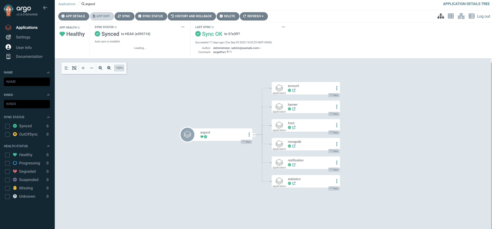

# application.yaml -> apps -> chart

1.helm chart 여러 개를 생성한 것을 Chart에 넣어두고
2.apps 에서 argocd에서 app create 할 때 나오는 yaml파일을 넣어두고
3.application.yaml가 해당 yaml파일을 create 해주는 것과 동일한 역할을 함  

- 근데 문제가 있음...
  
- appofapp/apps/app-*yaml에 values.yaml이 적용이 안되는 듯한 nul error가 발생해서
- helm 문법 말고 하드코딩하면 app of apps 패턴으로 배포가 되는 것까지 확인했고
- 변수로 한번에 적용하는 건 테스트 예정   
  
  
