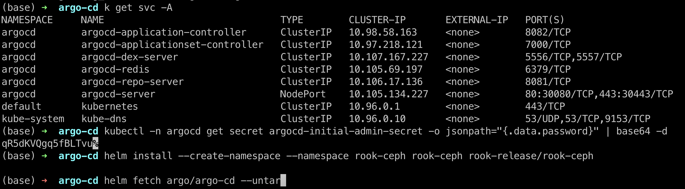
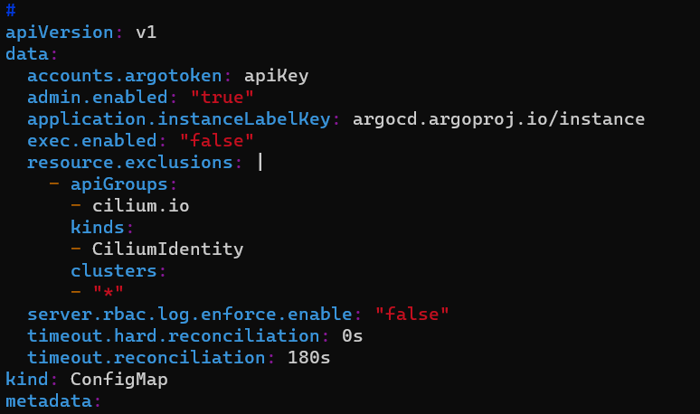
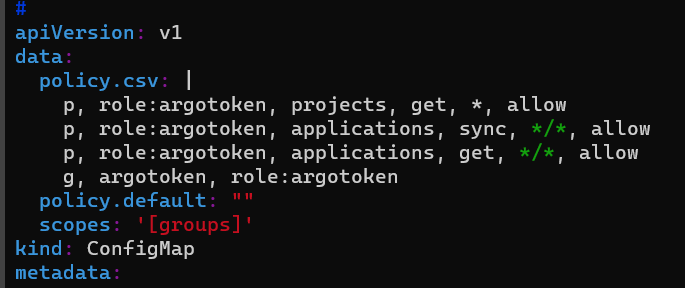

#argocd helm install(nodeport 접속)

```bash
helm repo add argo https://argoproj.github.io/argo-helm
helm install -n argocd --create-namespace argocd argo/argo-cd --set server.service.type=NodePort
```

#기본 비밀번호 확인

```bash
kubectl -n argocd get secret argocd-initial-admin-secret -o jsonpath="{.data.password}" | base64 -d
```




#레포지토리 로그인

```bash

arogcd와 git 레포지토리에 로그인하여 권한을 받아오는 과정.

connect repo를 클릭하면 
접근 방법중 HTTPS, SSH, GitHub CLI을 선택할 수 있는데 SSH로 접근.

레포지토리를 구분할 이름과 git url, git에 등록한 key쌍중 pri key를 입력하여
접근할 수 있는지 확인 할 수 있다.
 
```


```bash
new SSH Key 버튼을 눌러, ssh-keygen으로 생성한 키 쌍중 pub key를 등록한다.
pri key를 갖고 있는 사람은 git 계정에 접근 할 수 있게 된다.
```


```bash
git clone 중 ssh방식의 url을 argocd에 기입한다.
```


### ingress.yaml

```bash
apiVersion: networking.k8s.io/v1
kind: Ingress
metadata:
  annotations:
    cert-manager.io/issuer: letsencrypt-prod
    meta.helm.sh/release-name: argocd
    meta.helm.sh/release-namespace: argocd
    nginx.ingress.kubernetes.io/backend-protocol: HTTPS
    nginx.ingress.kubernetes.io/cors-expose-headers: '*, X-CustomResponseHeader'
    nginx.ingress.kubernetes.io/ssl-passthrough: "true"
  creationTimestamp: "2023-10-23T08:55:22Z"
  generation: 4
  labels:
    app.kubernetes.io/component: server
    app.kubernetes.io/instance: argocd
    app.kubernetes.io/managed-by: Helm
    app.kubernetes.io/name: argocd-server
    app.kubernetes.io/part-of: argocd
    app.kubernetes.io/version: v2.8.4
    helm.sh/chart: argo-cd-5.46.8
  name: argocd-server
  namespace: argocd
  resourceVersion: "458598"
  uid: 553fa676-46ee-4d16-9299-7ccbd4bc9358
spec:
  ingressClassName: nginx
  rules:
  - host: argocd.srrain.kro.kr
    http:
      paths:
      - backend:
          service:
            name: argocd-server
            port:
              number: 80
        path: /
        pathType: Prefix
  tls:
  - hosts:
    - argocd.srrain.kro.kr
    secretName: argocd
```

### argoCD에서 app을 삭제했을때 kuberenetes 리소스는 보존하고 싶음

삭제할 때 Non-cascading 옵션으로 삭제


### 415 Unable to delete resource: Unsupported Media Type 해결

```
      containers:
        - args:
            - /usr/local/bin/argocd-server
            - '--api-content-types'
            - application/json;application/x-www-form-urlencoded
```

---
# sync용 argoCD Token 생성

**1. argoCD user 생성**

```yaml
kubectl edit cm  argocd-cm -n argocd

---
data:
  accounts.{username}: apiKey
```


**2. user 권한 설정**

```yaml
kubectl edit cm -n argocd argocd-rbac-cm

---
data:
  policy.csv: |
    p, role:argotoken, projects, get, *, allow
    p, role:argotoken, applications, sync, */*, allow
    p, role:argotoken, applications, get, */*, allow
    g, argotoken, role:argotoken
```


**3. token 생성**

```bash
argocd account generate-token -a yourUserName
```

1. **Gitlab adminarea - ci/cd - Variables 에 변수 등록**


1. gitlab ci에서 사용