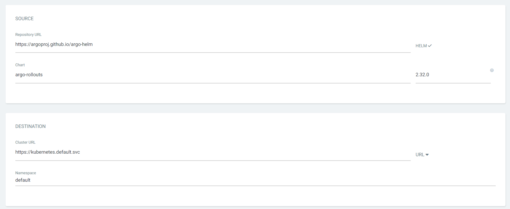

# Blue Green 배포

argoCD의 플러그인 기능으로 Rollout 솔루션을 배포하면

argo의 blue green과 canary 배포를 사용할 수 있습니다.

쿠버네티스의 기본 기능으로는 deployment를 2개 띄운 후 

service에서 seleteor를 번갈아 지정하는 방식으로 blue green 배포를 만들 수 있습니다.

helm chart 확인


repo 등록


app 생성




value 오버라이드


---

배포 확인


rollout CRD가 생성되었으므로  Deployment Rollouts로 변경합니다.

```bash
apiVersion: apps/v1
kind: Deployment
```


→

```bash
apiVersion: argoproj.io/v1alpha1
kind: Rollouts
```


deployment 가장 아래에 strategy를 추가합니다.

```bash
  strategy:
    blueGreen:
      activeService: rollout-test-blue
      autoPromotionEnabled: true
      previewReplicaCount: 1
      previewService: rollout-test-green
      scaleDownDelaySeconds: 3600
```


```bash
activeService: 
  실 service의 selector로 지정될 이름
previewService: 
  테스트 service의 selector로 지정될 이름

autoPromotionEnabled: true
  blue green 변환을 관리자가 승인해야하는지 여부
previewReplicaCount: 1
  테스트 pod의 갯수 (hpa가 동작하고 있으면 적용되지 않음)
scaleDownDelaySeconds: 3600
  green pod가 삭제되는 시간 (1시간 뒤에 삭제)

blue green 배포시 deployment가 2개 동시에 뜨고
관리자가 blue green 변경 승인 후
green deployment는 1시간 뒤에 삭제됨
```

green deployment가 내 외부로 트래픽을 전달하기 위해 쿠버네티스 Service가 2개가 필요합니다.


Rollouts에서 제공하는 dashboard에서 autoPromotionEnabled: false일 때 

Promote로 승인할 수 있습니다.


istio의 VirtualService와 Destination Rule로 

Blue Green 양쪽에 트래픽을 50:50으로 나누거나 할 수 있습니다.

```bash
apiVersion: networking.istio.io/v1alpha3
kind: VirtualService
metadata:
  name: rollout-test
  namespace: default
spec:
  gateways:
    - istio-system/rollout-test-gateway
  hosts:
    - '*'
  http:
    - route:
        - destination:
            host: rollout-test-blue
          weight: 50
        - destination:
            host: rollout-test-green
          weight: 50
```

gateway.yaml
```bash
apiVersion: networking.istio.io/v1alpha3
kind: Gateway
metadata:
  name: rollout-test-gateway
  namespace: default
spec:
  selector:
    istio: istio-system/ingressgateway
  servers:
    - hosts:
        - '*'
      port:
        name: http
        number: 80
        protocol: HTTP
```