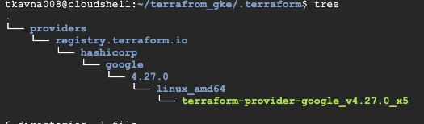

# GCP 쿠버네티스

---

### 테라폼 인프라 생성

테라폼을 사용하여 gcp 인프라와 쿠버네티스를 프로비저닝 한다.

- 테라폼 코드
    
    리소스 할당량 초과를 방지하기 위해 동일한 영역(단일 영역 클러스터)에 노드 2개로 구현된 GKE 클러스터
    
    versions.tf
    
    테라폼의 버전과 프로바이더가 뭔지 정의하는 기본 파일
    
    ```yaml
    terraform {
      required_providers {
        google = {
          source  = "hashicorp/google"
          version = "4.27.0"
        }
      }
      required_version = ">= 0.14"
    }
    
    provider "google" {
      project = var.project_id
      region  = var.region
      zone    = var.zone
    }
    ```
    
    vpc.tf
    
    VPC 리소스를 정의하는 파일
    
    ```yaml
    # VPC
    resource "google_compute_network" "vpc" {
      name                    = "${var.project_id}-vpc"
      auto_create_subnetworks = "false"
    }
    
    # Subnet
    resource "google_compute_subnetwork" "subnet" {
      name          = "${var.project_id}-subnet"
      region        = var.region
      network       = google_compute_network.vpc.name
      ip_cidr_range = "10.10.0.0/22" # 1024 addresses
      secondary_ip_range {
        ip_cidr_range = "10.10.4.0/22" # 1024 addresses -> 440 pods max for 4 nodes
        range_name    = "pods-addresses-range"
      }
      secondary_ip_range {
        ip_cidr_range = "10.10.8.0/25" # 128 addresses -> 100 services for example
        range_name    = "services-addresses-range"
      }
    }
    ```
    
    gke-cluster.tf
    
    쿠버네티스를 정의하는 파일
    
    ```yaml
    # Only to show knowledge in locals
    locals {
      cluster_name  = "${var.project_id}-${var.environment}-gke"
      nod_pool_name = "pool-${var.project_id}-${var.environment}"
      machine_type  = "e2-medium"
      disk_size_gb  = 50
      disk_type     = "pd-balanced"
      tags          = ["gke-node", "${var.project_id}-${var.environment}-gke"]
    }
    
    # GKE cluster
    resource "google_container_cluster" "primary" {
      name     = local.cluster_name
      location = var.zone
    
      # Will use Separately Managed Node Pool
      remove_default_node_pool = true
      initial_node_count       = 1
    
      node_config {
        disk_size_gb = local.disk_size_gb
        disk_type    = local.disk_type
      }
    
      network    = google_compute_network.vpc.name
      subnetwork = google_compute_subnetwork.subnet.name
    }
    
    # Separately Managed Node Pool
    resource "google_container_node_pool" "primary_nodes" {
      name       = local.nod_pool_name
      location   = var.zone
      cluster    = google_container_cluster.primary.name
      node_count = var.node_count
    
      node_config {
        oauth_scopes = [
          "https://www.googleapis.com/auth/logging.write",
          "https://www.googleapis.com/auth/monitoring",
        ]
    
        labels = {
          env = var.project_id
        }
    
        machine_type = local.machine_type
        disk_size_gb = local.disk_size_gb
        disk_type    = local.disk_type
        tags         = local.tags
        metadata = {
          disable-legacy-endpoints = "true"
        }
      }
    }
    ```
    
    variables.tf
    
    사용되는 변수를 정의하는 파일
    
    ```yaml
    variable "project_id" {
      description = "project id"
    }
    
    variable "region" {
      description = "region"
    }
    
    variable "zone" {
      description = "zone"
    }
    
    variable "environment" {
      description = "environment"
    }
    
    variable "node_count" {
      default     = 2
      description = "number of gke nodes"
    }
    ```
    
    terraform.tfvars
    
    기본 변수를 셋팅하는 파일 
    
    ```yaml
    project_id  = "internship-166-375809"
    region      = "europe-west6"
    zone        = "europe-west6-b"
    node_count  = 2
    environment = "prod"
    ```
    
    output.tf
    
    terraform plan이나 apply끝나고 나오는 출력 정의
    
    ```yaml
    output "region" {
      value       = var.region
      description = "GCloud Region"
    }
    
    output "zone" {
      value       = var.zone
      description = "GCloud Zone"
    }
    
    output "project_id" {
      value       = var.project_id
      description = "GCloud Project ID"
    }
    
    output "kubernetes_cluster_name" {
      value       = google_container_cluster.primary.name
      description = "GKE Cluster Name"
    }
    
    output "kubernetes_cluster_host" {
      value       = google_container_cluster.primary.endpoint
      description = "GKE Cluster Host"
    }
    ```
    

**terraform init** 명령어로 versions.tf에 정의된 프로바이더에 맞춰 플러그인을 다운받아 설치된다.



**terraform apply** 명령어를 입력해서 정의된 인프라를 생성한다.


완료됐을 때 output.tf에 정의된 변수들이 출력된다.


위에 출력된 문구를 보고 kubeconfig를 받아올 수 있다.

```yaml
kubernetes_cluster_name = "manifest-canto-414808-prod-gke"
project_id = "manifest-canto-414808"
region = "asia-northeast3"
zone = "asia-northeast3-b"
```

아래와 같이 구문에 맞게 명령어를 입력하여 실행하면 kubeconfig를 받아온다.

```yaml
gcloud container clusters get-credentials manifest-canto-414808-prod-gke \
       --region asia-northeast3-b \
       --project manifest-canto-414808
```


---

### ArgoCD 설치

ClusterIP로 생성 후 forward로 접근할 수 있지만 클라우드 쉘을 사용 중이기에 편한 방법으로 진행하겠습니다.

[forward 명령어로 clusterIP를 로컬에서 접근하는 가이드](https://kubernetes.io/ko/docs/tasks/access-application-cluster/port-forward-access-application-cluster/#%ED%8C%8C%EB%93%9C%EC%9D%98-%ED%8F%AC%ED%8A%B8%EB%A5%BC-%EB%A1%9C%EC%BB%AC-%ED%8F%AC%ED%8A%B8%EB%A1%9C-%ED%8F%AC%EC%9B%8C%EB%94%A9%ED%95%98%EA%B8%B0)

`kubectl port-forward service/argocd-server -n argocd 8080:443`

ArgoCD helm install(LoadBalancer 접속)

```bash
helm repo add argo https://argoproj.github.io/argo-helm
helm install -n argocd --create-namespace argocd argo/argo-cd --set server.service.type=LoadBalancer
```

#기본 비밀번호 확인

```bash
kubectl -n argocd get secret argocd-initial-admin-secret -o jsonpath="{.data.password}" | base64 -d && echo
```


AWS와는 다르게 도메인이 아닌 IP를 할당 받았다.


GCP에서 보이는 화면


해당 IP를 눌러 접근하면 ArgoCD가 나온다. 위에서 얻은 비밀번호로 접속할 수 있다.


로드밸런서의 트래픽  흐름


### **ingress-nginx 설치**

ArgoCD에서 Helm Chart를 배포하는 방법을 서술하며, 다른 차트도 동일한 방법으로 배포한다.

참고로 ArgoCD에서 배포하는 것은 Helm install과 동작이 같지 않아서 추가로 필요한 Values 값이 있을 수 있다. (Helm list에도 없음, 매니패스트로 변환해서 apply하는 느낌)

 

Settings - Repositories에서 [ingress-nginx Helm](https://artifacthub.io/packages/helm/ingress-nginx/ingress-nginx?modal=install)을 등록할 수 있다


위 링크에서 오른쪽에 있는 INSTALL을 눌러서 나온 명령어를 Argo에 옮겨 적는다.


CONNECT REPO를 눌러 나온 창에 아래와 같이 옮겨 적는다 (다른 Helm Chart도 동일)


등록된 것을 확인 할 수 있으며 오른쪽 점 3개를 클릭해서 곧바로 ArgoCD에 ingress-nginx를 등록한다.


Application Name에는 위 설치 명령어에 나왔던 Chart Name을 적는다.(다른 이름은 중복으로 붙어 길어짐)


AUTO-CREATE NAMESPACE를 클릭하여 배포할 때 네임스페이스가 없으면 자동으로 생성한다.


Repo URL은 자동으로 기입되어있으며 해당 레포가 갖고있는 Chart 목록을 볼 수 있다.

Chart를 선택 후 오른쪽에 버전도 같이 선택한다.


Cluster URL도 클릭하면 등록된 클러스터 목록이 나오며 로컬 클러스터를 클릭한다.

Namespace에는 구분할 네임스페이스를 기입한다.

SYNC POLICY에서 AUTOMATED으로 설정했기에 ArgoCD에 등록하자마자 sync되어 배포를 시작한다.


ArgoCD에서 배포하는 이유! 어떤 오브젝트가 배포되었는지 눈으로 보기 쉽고, 클릭하여 로그를 보기 용이하다.


그리고 DETAILS을 클릭해서 버전을 다운, 업그레이드하기 간편하다.


default ingress class 등록하는 방법

이렇게 등록하면 ingress를 생성할때  ingressClassName 가 없어도 자동으로 해당 ingress class로 들어간다.

```bash
kubectl patch ingressclass nginx \
  --patch '{"metadata":{"annotations":{"ingressclass.kubernetes.io/is-default-class":"true"}}}'
```


---

이제 외부IP를 가져오는 서비스가 2개인데 개당 비용이 청구되니 진입점을 줄여 비용을 절감한다.


아래 명령어를 통해 LoadBalancer 타입이였던 ArgoCD를 ClusterIP로 변경하고, annotate를 추가하여

ingress를 생성한다.

```bash
helm upgrade -n argocd argocd argo/argo-cd --set server.service.type=ClusterIP,server.ingress.enabled=true,server.ingress.hostname=argocd.srrain.kro.kr

kubectl annotate ingress -n argocd argocd-server  nginx.ingress.kubernetes.io/backend-protocol=HTTPS
kubectl annotate ingress -n argocd argocd-server  nginx.ingress.kubernetes.io/cors-expose-headers='*, X-CustomResponseHeader'
kubectl annotate ingress -n argocd argocd-server  nginx.ingress.kubernetes.io/ssl-passthrough="true"
```


DNS 관리 사이트(유료 혹은 무료)에서 위에서 나온 HOSTS와 ADDRESS를 적어서 DNS를 공개한다.


그러면 도메인을 통해서 쿠버네티스 서비스에 접근할 수 있게 된다.


---

음......뭘더추가하지...