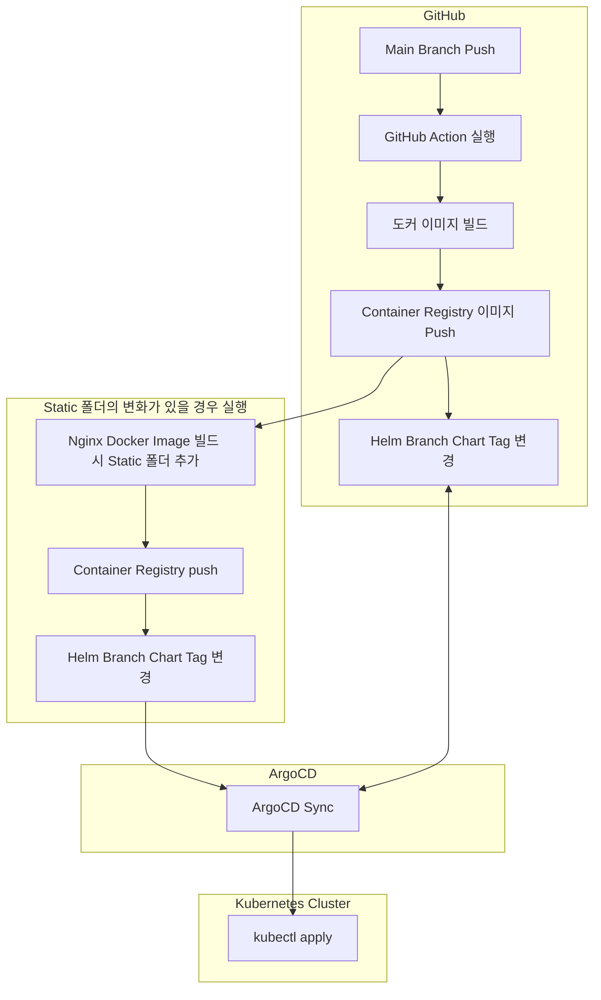

### 아키텍처



### 코드 
```yaml
name: Docker Image CI

on:
  push:
    branches: [ "master" ]
  pull_request:
    branches: [ "master" ]

permissions:
  contents: write

env:
  REGISTRY: docker-image.kr.ncr.ntruss.com
  IMAGE_NAME: django
  IMAGE_NAME2: django-nginx
  ACCESS_KEY: 123
  SECRET_KEY: 456
  
jobs:
  build-and-push-image:
    runs-on: ubuntu-latest
    outputs: 
      sha_short1: ${{ steps.vars.outputs.sha_short }}
      LOG1: ${{ steps.vars.outputs.LOG }}
      folder_changed1: ${{ steps.folder-changes.outputs.folder_changed }}
      
    steps:
    - name: Checkout
      uses: actions/checkout@v4
      with:
        fetch-depth: 2

    - name: Login to DockerHub
      uses: docker/login-action@v3
      with:
        registry: ${{ env.REGISTRY }}
        username: ${{ env.ACCESS_KEY }}
        password: ${{ env.SECRET_KEY }}
        # username: ${{ secrets.ACCESS_KEY }}
        # password: ${{ secrets.SECRET_KEY }}
        
    - name: Set outputs
      id: vars
      run: |
        echo "sha_short=$(git rev-parse --short HEAD)" >> $GITHUB_OUTPUT
        
        git log | sed -n 5p > log.txt
        echo "LOG=`cat log.txt`" >> $GITHUB_OUTPUT
      #echo "LOG=$(git log --oneline -n 1)" >> $GITHUB_OUTPUT

		- name: Check for folder changes
      id: folder-changes
      run: |
          git update-index --refresh
          if git diff --quiet HEAD^ HEAD -- NWAD/static; then
            echo "folder_changed=off" >> $GITHUB_OUTPUT
          else
            echo "folder_changed=on" >> $GITHUB_OUTPUT
          fi        

    - name: Check outputs
      run: |
        echo ${{ steps.vars.outputs.sha_short }}
        echo ${{ steps.vars.outputs.LOG }}
        echo ${{ steps.folder-changes.outputs.folder_changed }}

    - name: Build and push
      id: docker_build
      uses: docker/build-push-action@v5
      with:
        push: true
        tags: ${{ env.REGISTRY }}/${{ env.IMAGE_NAME }}:${{ steps.vars.outputs.sha_short }}

        
    - name: Modify file on other branch
      run: |
        git remote update
        git branch -a
        git checkout helm  # 다른 브랜치로 전환

        OLD_TAG=`cat values.yaml | grep -i "tag:\ " | awk 'NR == 1 {print $2}'`
        NEW_TAG=\"${{ steps.vars.outputs.sha_short }}\"
        
        sed -i "s#${OLD_TAG}#${NEW_TAG}#g" values.yaml # tag 변경
        
        git config user.name "Github action"
        git config user.email "GithubAction@example.com"
        
        git add values.yaml 
        git commit -m "change tag: ${{ steps.vars.outputs.LOG }}"
        
        git push origin helm  # 원격 저장소에 푸시
      
        
  nginx-dockerizing:
    runs-on: ubuntu-latest
    needs: build-and-push-image
    if: ${{ needs.build-and-push-image.outputs.folder_changed1 == 'on' }}
    steps:
    - name: Checkout code
      uses: actions/checkout@v4

    - name: Login to DockerHub
      uses: docker/login-action@v3
      with:
        registry: ${{ env.REGISTRY }}
        username: ${{ env.ACCESS_KEY }}
        password: ${{ env.SECRET_KEY }}
        # username: ${{ secrets.ACCESS_KEY }}
        # password: ${{ secrets.SECRET_KEY }}

    - name: Check-outputs
      run: |
        echo sha_short1: ${{ needs.build-and-push-image.outputs.sha_short1 }}
        echo LOG1: ${{ needs.build-and-push-image.outputs.LOG1 }}

    - name: nginx docker image push to NCP
      uses: docker/build-push-action@v5
      with:
        context: .
        file: nginx-Dockerfile
        push: true
        tags:  ${{ env.REGISTRY }}/${{ env.IMAGE_NAME2 }}:${{ needs.build-and-push-image.outputs.sha_short1 }}

    - name: helm tag change
      run: |
        git remote update
        git branch -a
        git checkout nginx-helm  

        OLD_TAG=`cat values.yaml | grep -i "tag:\ " | awk 'NR == 1 {print $2}'`
        NEW_TAG="${{ needs.build-and-push-image.outputs.sha_short1 }}"
        echo sha_short1: ${{ needs.build-and-push-image.outputs.sha_short1 }}
        
        sed -i "s#${OLD_TAG}#${NEW_TAG}#g" values.yaml # tag 변경
        
        git config user.name "Github action"
        git config user.email "GithubAction@example.com"
        
        git add values.yaml 
        echo LOG1: ${{ needs.build-and-push-image.outputs.LOG1 }}
        git commit -m "change tag: ${{ needs.build-and-push-image.outputs.LOG1 }}"
        
        git push origin nginx-helm
```