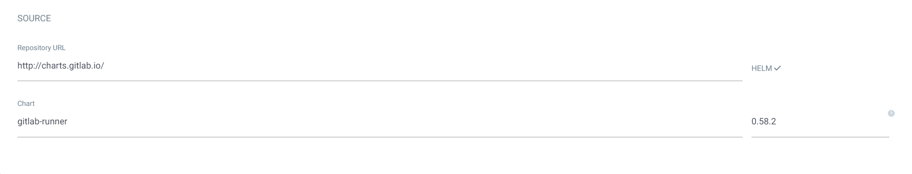

ArgoCD에서 Gitlab Runner Chart 등록



values.yaml

```bash
# gitlab url 입력
gitlabUrl: https://gitlab.srrain.kro.kr

# registration token 생성(CI/CD > Runner > New Project Runner)
runnerRegistrationToken: glrt-eRDrwGcJ8B*********

# runner가 pod 생성 가능하게 권한 추가
rbac: 
  create: true

# docker in docker 가능하도록 socker 공유 및 기본 이미지 지정
runners:
  config: |
    [[runners]]
      [runners.kubernetes]
        image = "ubuntu:20.04"
        privileged=true
      [[runners.kubernetes.volumes.host_path]]
        name = "docker-socket"
        mount_path = "/var/run/docker.sock"
        read_only = false
        host_path = "/var/run/docker.sock"
```

CI 스크립트에 들어가야 하는 것

```bash
image: docker:stable-dind
#pod에서 docker socker 가져올 때까지 기다리기
before_script:
    - docker --version
    - until docker info; do sleep 1; done
```