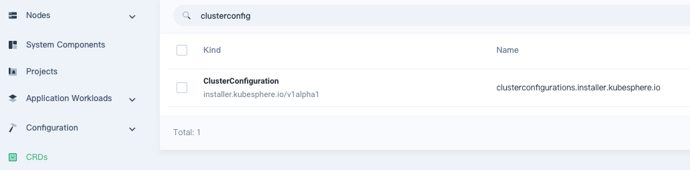
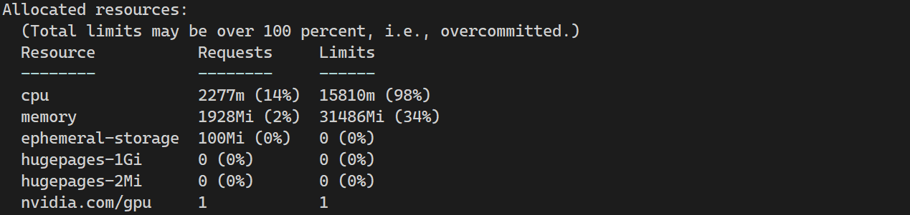
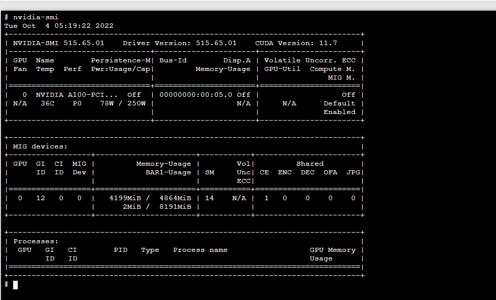
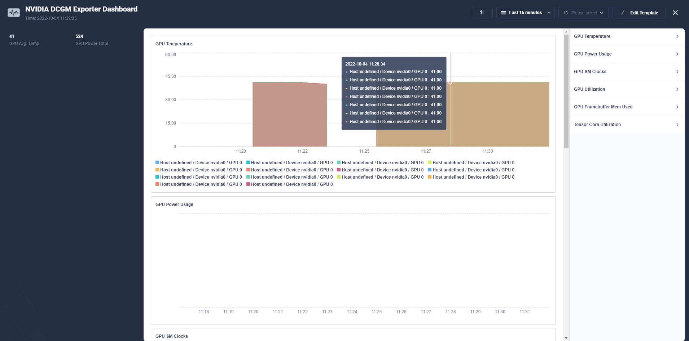
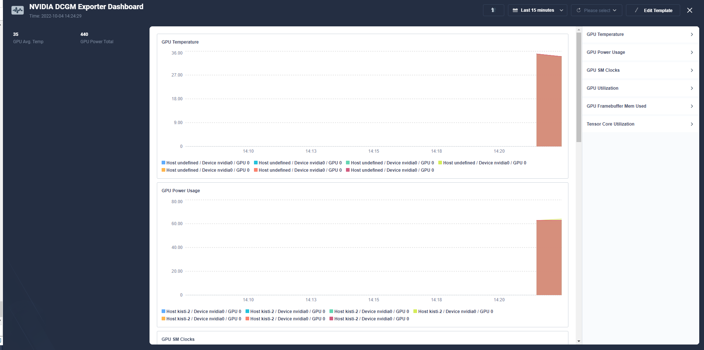

- 목차

# **kubenertes cenots7 install**

```bash
# 깡통 os에 필요한 기본 설치
sudo yum install -y tar bzip2 make automake gcc gcc-c++ \
pciutils elfutils-libelf-devel libglvnd-devel \
iptables firewalld bind-utils git \
vim wget

sudo yum update -y

# yum kubernetes 저장소 추가
cat <<EOF | sudo tee /etc/yum.repos.d/kubernetes.repo
[kubernetes]
name=Kubernetes
baseurl=https://packages.cloud.google.com/yum/repos/kubernetes-el7-\$basearch
enabled=1
gpgcheck=1
gpgkey=https://packages.cloud.google.com/yum/doc/yum-key.gpg https://packages.cloud.google.com/yum/doc/rpm-package-key.gpg
exclude=kubelet kubeadm kubectl
EOF

# permissive 모드로 SELinux 설정(효과적으로 비활성화)
sudo setenforce 0
sudo sed -i 's/^SELINUX=enforcing$/SELINUX=permissive/' /etc/selinux/config

#swap 끄기 && 방화벽 끄기(규칙 추가 대신)
sudo swapoff -a && sudo sed -i '/swap/s/^/#/' /etc/fstab
sudo systemctl disable firewalld

#iptables 설정
cat <<EOF > /etc/sysctl.d/k8s.conf
net.bridge.bridge-nf-call-ip6tables = 1
net.bridge.bridge-nf-call-iptables = 1
EOF

#도커 설치
curl -fsSL https://get.docker.com | sudo sh

#도커 cgroup systemd로 변경
#현재 cgroup 확인
docker info | grep -i cgroup
Cgroup Driver: cgroupfs
Cgroup Version: 1

#daemon.json 값을 통해 cgroup systemd로 변경
cat <<EOF > /etc/docker/daemon.json
{
  "exec-opts": ["native.cgroupdriver=systemd"]
}
EOF

# docker restart 
sudo systemctl restart docker

#kube tools 설치
sudo yum install -y kubelet-1.21.0 kubeadm-1.21.0 kubectl-1.21.0 --disableexcludes=kubernetes
sudo systemctl enable --now kubelet
sudo systemctl enable docker
sudo systemctl start docker

#쿠버네티스 구성
kubeadm init

#쿠버네티스 config 파일 복사
unset KUBECONFIG
mv  $HOME/.kube $HOME/.kube.bak
export KUBECONFIG=/etc/kubernetes/admin.conf
mkdir -p $HOME/.kube
sudo cp -i /etc/kubernetes/admin.conf $HOME/.kube/config
sudo chown $(id -u):$(id -g) $HOME/.kube/config

#마스터 노드에도 pod 배포할 수 있게 taint 제거 
kubectl taint nodes --all node-role.kubernetes.io/master-

#network cni 배포
kubectl apply -f https://docs.projectcalico.org/manifests/calico.yaml
```

#nouveau 드라이버를 불러왔는지 확인

```bash
 lsmod | grep -i nouveau
```

#Nouveau 드라이버 비활성화

 vim /etc/modprobe.d/blacklist-nouveau.conf

```bash
blacklist nouveau
options nouveau modeset=0
```

#커널 initramfs를 재생성

```bash
 sudo dracut --force
```

# **helm 설치**

```bash
PATH=$PATH:/usr/local/bin
curl -fsSL -o get_helm.sh https://raw.githubusercontent.com/helm/helm/master/scripts/get-helm-3 \
&& chmod 700 get_helm.sh \
&& ./get_helm.sh
```

# 깡통 쿠버네티스에 gpu-operator helm 설치

```bash
helm repo add nvidia https://helm.ngc.nvidia.com/nvidia
helm repo update

helm install --wait --generate-name \
     -n gpu-operator --create-namespace \
     nvidia/gpu-operator \
     --set toolkit.version=v1.11.0-centos7\

# MIG gpu 쪼개서 쓸 수 있는 label 등록(가변성)
kubectl label nodes/kisti-3 nvidia.com/mig.config=all-1g.5gb
```

모든 pod가 정상적으로 올라오는데  약 10분 소요

# **실패시 host에 직접 nvidia 설치해서 gpu operator 설치하기**

#도커 런타임 nvidia로 바꾸기

```bash
distribution=$(. /etc/os-release;echo $ID$VERSION_ID)
curl -s -L https://nvidia.github.io/nvidia-docker/$distribution/nvidia-docker.repo | \
  sudo tee /etc/yum.repos.d/nvidia-docker.repo
#택1 or
distribution=$(. /etc/os-release;echo $ID$VERSION_ID) \
   && curl -s -L https://nvidia.github.io/libnvidia-container/$distribution/libnvidia-container.repo | sudo tee /etc/yum.repos.d/nvidia-container-toolkit.repo
sudo yum update
sudo yum clean expire-cache
sudo yum install -y nvidia-docker2
```

#  "default-runtime": "nvidia", 추가하기 

sudo vim /etc/docker/daemon.json

```bash
{
    "default-runtime": "nvidia",
    "runtimes": {
        "nvidia": {
            "path": "nvidia-container-runtime",
            "runtimeArgs": []
        }
    }
}
```

```bash
mkdir -p /etc/systemd/system/docker.service.d

tee /etc/systemd/system/docker.service.d/override.conf <<EOF
[Service]
ExecStart=
ExecStart=/usr/bin/dockerd --host=fd:// --add-runtime=nvidia=/usr/bin/nvidia-container-runtime
EOF
```

#도커 런타임 재시작

```bash
sudo systemctl daemon-reload
sudo systemctl restart docker
sudo systemctl restart containerd
docker info | grep -i run
```

#변경사항 적용

`sysctl --system`

#gpu-operator 설치 (host os 버전에 맞춰서)

```bash
#드라이버 컨테이너에 의해 마운트된 경로로 사용하도록 toolkit 구성(빼고 helm 먼저 시도가 가능성 높음)
sudo sed -i 's/^#root/root/' /etc/nvidia-container-runtime/config.toml

helm install --wait --generate-name\
     -n gpu-operator --create-namespace\
     nvidia/gpu-operator\
     --set toolkit.enabled=false
```

진짜 안되면 https://docs.nvidia.com/datacenter/tesla/tesla-installation-notes/index.html#centos7

참조하여 드라이버랑 툴킷 os에 설치해서 `k8s-device-plugin` helm 배포 

---

# kubesphere 정리

개인 저장소가(harbor) 공인인증서를 갖고 있어야하고

kubesphere에서 제공해주는 스크립트를 통해 필요한 이미지들 개인 저장소에 push

sc.yaml과 kubesphere-installer.yaml, cluster-configuration.yaml의 image부분을 개인 저장소로 변경하고

순서대로 생성하기(kubesphere-installer.yaml 로 생성된 설정을 cluster-configuration.yaml로 덮어씀)

sc의 local-storage를 모니터링 pv로 사용함

vim sc.yaml

```yaml
cat <<EOF > sc.yaml
apiVersion: [storage.k8s.io/v1](http://storage.k8s.io/v1)
kind: StorageClass
metadata:
  name: local-storage
provisioner: [kubernetes.io/no-provisioner](http://kubernetes.io/no-provisioner)
volumeBindingMode: WaitForFirstConsumer
EOF
```

# default storageClass 등록

```bash
kubectl patch storageclass local-storage -p '{"metadata": {"annotations":{"storageclass.kubernetes.io/is-default-class":"true"}}}'
```

```bash
kubectl apply -f https://github.com/kubesphere/ks-installer/releases/download/v3.3.1/kubesphere-installer.yaml
kubectl apply -f https://github.com/kubesphere/ks-installer/releases/download/v3.3.1/cluster-configuration.yaml
```

mkdir -p  /mnt/data

vim prometheus-pv.yaml

```yaml
cat <<EOF > prometheus-pv.yaml
apiVersion: v1
kind: PersistentVolume
metadata:
  name: prom-pv
  namespace: kubesphere-monitoring-system
spec:
  storageClassName: local-storage
  capacity:
    storage: 20Gi
  accessModes:
    - ReadWriteOnce
  hostPath:
    path: "/mnt/data"
    type: DirectoryOrCreate
EOF
```

# log 확인하기(id,pw 확인)

```bash
kubectl logs -n kubesphere-system $(kubectl get pod -n kubesphere-system -l 'app in (ks-install, ks-installer)' -o jsonpath='{.items[0].metadata.name}') -f
```

#**kubesphere끼리 연동하기**

kubesphere dashborads - CRDs - ClusterConfiguration - ks-installer를 edit yaml로 수정하기




```yaml
# Host로 쓸 kubesphere의 configmap을 수정
multicluster:
  clusterRole: host

# Token값 가져오기 (host - member 일치시켜야함)
kubectl -n kubesphere-system get cm kubesphere-config -o yaml | grep -v "apiVersion" | grep jwtSecret

```


```yaml
# member로 쓸 kubesphere의 ****ks-installer configmap을 수정
multicluster:
  clusterRole: member

#가져온 token값 사용
authentication:
    jwtSecret: 5FRuWhv81hJcPqILZMD5qaVJlzLqkomQ
```


```bash
host에서 add cluster -> 
cluster name에 알 수 있도록 이름 명시 #(선택사항 tag, 공급자 명시) ->
next 클릭 후 

#1 direct connection
member의 ~/.kube/config 파일 복사 붙여넣기 -> 
create 클릭 후 대기

#2 agent connection
보이는 yaml파일을 member에 직접 생성
vi agent.yaml에 복사 붙여넣기
kubectl apply -f agent.yaml 후 대기

#! jwtSecret가 무조건 동일해야함(아무 클러스터나 등록 방지)
```


#gpu 모니터링

```bash
#CRDs - ClusterConfiguration - ks-installer edit
monitoring:
  GPUMonitoring:
    enabled: true

monitoring:
  gpu:
    nvidia_dcgm_exporter:
      enabled: true
```


```bash
curl https://raw.githubusercontent.com/NVIDIA/dcgm-exporter/main/etc/dcp-metrics-included.csv > dcgm-metrics.csv
kubectl create configmap metrics-config -n gpu-operator --from-file=dcgm-metrics.csv
```

- gpu monitoring dcgm pod 활성화 방안

#gpu-operator에서 dcgm포트 중복사용으로 인하여 해당 옵션 비활성화

```bash
—set dcgmExporter.enabled: false
```

#pod configmap에 있는 dcgm-metrics.csv을 미리 생성해 둡니다.

```bash
mkdir -p /etc/dcgm-exporter/

curl https://raw.githubusercontent.com/NVIDIA/dcgm-exporter/main/etc/dcp-metrics-included.csv > /etc/dcgm-exporter/dcgm-metrics.csv
kubectl create configmap metrics-config -n kubesphere-monitoring-system --from-file=/etc/dcgm-exporter/dcgm-metrics.csv
```

#nvidia-dcgm-exporter에서 짜깁기한 gpu-dcgm-exporter를 현상황에 맞게 수정하여 edit daemonset

```yaml
apiVersion: apps/v1
kind: DaemonSet
metadata:
  annotations:
    deprecated.daemonset.template.generation: "5"
    meta.helm.sh/release-name: gpu-dcgm-exporter
    meta.helm.sh/release-namespace: kubesphere-monitoring-system
  creationTimestamp: "2022-10-05T07:23:34Z"
  generation: 5
  labels:
    app.kubernetes.io/component: dcgm-exporter
    app.kubernetes.io/instance: gpu-dcgm-exporter
    app.kubernetes.io/managed-by: Helm
    app.kubernetes.io/name: dcgm-exporter
    app.kubernetes.io/version: 2.4.0-rc.3
    helm.sh/chart: dcgm-exporter-2.4.0-rc.3
  name: gpu-dcgm-exporter
  namespace: kubesphere-monitoring-system
  resourceVersion: "500350"
  uid: 5e720b8a-dbd9-49cb-908e-7ce64893a75d
spec:
  revisionHistoryLimit: 10
  selector:
    matchLabels:
      app.kubernetes.io/component: dcgm-exporter
      app.kubernetes.io/instance: gpu-dcgm-exporter
      app.kubernetes.io/name: dcgm-exporter
  template:
    metadata:
      creationTimestamp: null
      labels:
        app.kubernetes.io/component: dcgm-exporter
        app.kubernetes.io/instance: gpu-dcgm-exporter
        app.kubernetes.io/name: dcgm-exporter
    spec:
      affinity:
        nodeAffinity:
          requiredDuringSchedulingIgnoredDuringExecution:
            nodeSelectorTerms:
            - matchExpressions:
              - key: nvidia.com/gpu.present
                operator: Exists
      containers:
      - env:
        - name: DCGM_EXPORTER_KUBERNETES
          value: "true"
        - name: DCGM_EXPORTER_LISTEN
          value: :9400
        - name: DCGM_EXPORTER_COLLECTORS
          value: /etc/dcgm-exporter/dcp-metrics-included.csv
        image: nvcr.io/nvidia/k8s/dcgm-exporter:3.0.4-3.0.0-ubuntu20.04
        imagePullPolicy: IfNotPresent
        livenessProbe:
          failureThreshold: 3
          httpGet:
            path: /health
            port: 9400
            scheme: HTTP
          initialDelaySeconds: 30
          periodSeconds: 5
          successThreshold: 1
          timeoutSeconds: 1
        name: exporter
        ports:
        - containerPort: 9400
          name: metrics
          protocol: TCP
        readinessProbe:
          failureThreshold: 3
          httpGet:
            path: /health
            port: 9400
            scheme: HTTP
          initialDelaySeconds: 30
          periodSeconds: 10
          successThreshold: 1
          timeoutSeconds: 1
        resources:
          limits:
            cpu: "1"
            memory: 1280Mi
          requests:
            cpu: 100m
            memory: 128Mi
        securityContext:
          capabilities:
            add:
            - SYS_ADMIN
          runAsNonRoot: false
          runAsUser: 0
        terminationMessagePath: /dev/termination-log
        terminationMessagePolicy: File
        volumeMounts:
        - mountPath: /var/lib/kubelet/pod-resources
          name: pod-gpu-resources
          readOnly: true
      dnsPolicy: ClusterFirst
      initContainers:
      - args:
        - until [ -f /run/nvidia/validations/toolkit-ready ]; do echo waiting for
          nvidia container stack to be setup; sleep 5; done
        command:
        - sh
        - -c
        image: nvcr.io/nvidia/cloud-native/gpu-operator-validator:v22.9.0
        imagePullPolicy: IfNotPresent
        name: toolkit-validation
        resources: {}
        securityContext:
          privileged: true
        terminationMessagePath: /dev/termination-log
        terminationMessagePolicy: File
        volumeMounts:
        - mountPath: /run/nvidia
          mountPropagation: HostToContainer
          name: run-nvidia
      restartPolicy: Always
      schedulerName: default-scheduler
      securityContext: {}
      serviceAccount: gpu-dcgm-exporter
      serviceAccountName: gpu-dcgm-exporter
      terminationGracePeriodSeconds: 30
      volumes:
      - hostPath:
          path: /var/lib/kubelet/pod-resources
          type: ""
        name: pod-gpu-resources
      - hostPath:
          path: /run/nvidia
          type: ""
        name: run-nvidia
  updateStrategy:
    rollingUpdate:
      maxSurge: 0
      maxUnavailable: 1
    type: RollingUpdate
status:
  currentNumberScheduled: 1
  desiredNumberScheduled: 1
  numberAvailable: 1
  numberMisscheduled: 0
  numberReady: 1
  observedGeneration: 5
  updatedNumberScheduled: 1
```

추가한 부분

```bash
      - env:
        - name: DCGM_EXPORTER_COLLECTORS
          value: /etc/dcgm-exporter/dcp-metrics-included.csv
        image: nvcr.io/nvidia/k8s/dcgm-exporter:3.0.4-3.0.0-ubuntu20.04
```

```bash
        resources:
          limits:
            cpu: "1"
            memory: 1280Mi
```

```bash
      initContainers:
      - args:
        - until [ -f /run/nvidia/validations/toolkit-ready ]; do echo waiting for
          nvidia container stack to be setup; sleep 5; done
        command:
        - sh
        - -c
        image: nvcr.io/nvidia/cloud-native/gpu-operator-validator:v22.9.0
        imagePullPolicy: IfNotPresent
        name: toolkit-validation
        resources: {}
        securityContext:
          privileged: true
        terminationMessagePath: /dev/termination-log
        terminationMessagePolicy: File
        volumeMounts:
        - mountPath: /run/nvidia
          mountPropagation: HostToContainer
          name: run-nvidia
```

```bash
      volumes:
      - hostPath:
          path: /run/nvidia
          type: ""
        name: run-nvidia
```

---

# GPU-monitoring 실습(딥러닝)

참고 url : [https://kubesphere.io/zh/blogs/gpu-operator/#利用-kubesphere-自定义监控功能监控-gpu](https://kubesphere.io/zh/blogs/gpu-operator/#%E5%88%A9%E7%94%A8-kubesphere-%E8%87%AA%E5%AE%9A%E4%B9%89%E7%9B%91%E6%8E%A7%E5%8A%9F%E8%83%BD%E7%9B%91%E6%8E%A7-gpu)

1. 실습 예제 yaml file

```yaml
# 실습 예제 1
vi cuda-load-generator.yaml
apiVersion: v1
kind: Pod
metadata:
  name: dcgmproftester
spec:
  restartPolicy: OnFailure
  containers:
  - name: dcgmproftester11
    image: nvidia/samples:dcgmproftester-2.0.10-cuda11.0-ubuntu18.04
    args: ["--no-dcgm-validation", "-t 1004", "-d 120"]
    resources:
      limits:
        nvidia.com/gpu: 1
    securityContext:
      capabilities:
        add: ["SYS_ADMIN"]

# 실습 예제 2
curl -LO https://nvidia.github.io/gpu-operator/notebook-example.yml

cat notebook-example.yml
apiVersion: v1
kind: Service
metadata:
  name: tf-notebook
  labels:
    app: tf-notebook
spec:
  type: NodePort
  ports:
  - port: 80
    name: http
    targetPort: 8888
    nodePort: 30001
  selector:
    app: tf-notebook
---
apiVersion: v1
kind: Pod
metadata:
  name: tf-notebook
  labels:
    app: tf-notebook
spec:
  securityContext:
    fsGroup: 0
  containers:
  - name: tf-notebook
    image: tensorflow/tensorflow:latest-gpu-jupyter
    resources:
      limits:
        nvidia.com/gpu: 1
    ports:
    - containerPort: 8
```

1. 배포

```bash
kubectl apply -f cuda-load-generator.yaml 
pod/dcgmproftester created

kubectl apply -f notebook-example.yml       
service/tf-notebook created
pod/tf-notebook created
```

1. gpu 할당된 상태 확인

`kubectl describe node kisti-2`



1. 배포한 pod 및 svc 확인

```bash
# pod 
[root@kisti-2 gpu-test]# kubectl get pods -n default
NAME             READY   STATUS      RESTARTS   AGE
dcgmproftester   0/1     Completed   0          26m
tf-notebook      1/1     Running     0          26m

# svc
[root@kisti-2 gpu-test]# kubectl get svc -n default
NAME          TYPE        CLUSTER-IP     EXTERNAL-IP   PORT(S)        AGE
kubernetes    ClusterIP   10.96.0.1      <none>        443/TCP        45m
tf-notebook   NodePort    10.111.15.29   <none>        80:30001/TCP   26m
```

1. jupyter notebook 로그인 정보(token) 확인 및 로그인

```bash
kubectl logs tf-notebook

[I 05:16:29.254 NotebookApp] Writing notebook server cookie secret to /root/.local/share/jupyter/runtime/notebook_cookie_secret
[I 05:16:29.452 NotebookApp] Serving notebooks from local directory: /tf
[I 05:16:29.452 NotebookApp] Jupyter Notebook 6.4.12 is running at:
[I 05:16:29.452 NotebookApp] http://tf-notebook:8888/?token=600ffbb3e3659aa80633adae8b7541150004c28cc0986b82
[I 05:16:29.453 NotebookApp]  or http://127.0.0.1:8888/?token=600ffbb3e3659aa80633adae8b7541150004c28cc0986b82
[I 05:16:29.453 NotebookApp] Use Control-C to stop this server and shut down all kernels (twice to skip confirmation).

# token = 600ffbb3e3659aa80633adae8b7541150004c28cc0986b82

# jupyter notebook 접속 정보 = http://<public ip>:30001
```

1. jupyter notebook에서 test 작업 실행 (딥러닝 실행)
- terminal 열기


- 딥러닝 test 실행

```bash
# test 예제 가져오기
git clone https://github.com/zhu733756/tesnsorflow-mnist
cd tensorflow-mnist

# 실행
python3 mnist.py
```

- 실행 중에 다른 terminal 열어서 gpu 사용량 확인



- Dashboard 확인

#gpu-dashboard 화면





---

# kubectl 치트시트

```bash
yum install -y bash-completion

echo 'source <(kubectl completion bash)' >>~/.bashrc
echo 'alias k=kubectl' >>~/.bashrc
echo 'complete -o default -F __start_kubectl k' >>~/.bashrc
source ~/.bashrc

or 

kubectl completion bash | sudo tee /etc/bash_completion.d/kubectl > /dev/null
source /etc/profile.d/bash_completion.sh
```
<details>
<summary>nvidia driver os install</summary>
<div markdown="1">

#helm gpu-operator 삭제

```bash
helm delete -n gpu-operator $(helm list -n gpu-operator | grep gpu-operator | awk '{print $1}')
```

#nvidia docker2 install

```bash
distribution=$(. /etc/os-release;echo $ID$VERSION_ID) \
   && curl -s -L https://nvidia.github.io/libnvidia-container/$distribution/libnvidia-container.repo | sudo tee /etc/yum.repos.d/nvidia-container-toolkit.repo
sudo yum update
sudo yum clean expire-cache
sudo yum install -y nvidia-docker2

sudo vim /etc/docker/daemon.json

    "default-runtime": "nvidia",
```

```bash
mkdir -p /etc/systemd/system/docker.service.d

tee /etc/systemd/system/docker.service.d/override.conf <<EOF
[Service]
ExecStart=
ExecStart=/usr/bin/dockerd --host=fd:// --add-runtime=nvidia=/usr/bin/nvidia-container-runtime
EOF

sudo systemctl daemon-reload
sudo systemctl restart docker
sudo systemctl restart containerd
docker info | grep -i run
sudo sed -i 's/^#root/root/' /etc/nvidia-container-runtime/config.toml
sysctl --system
```

#nvidia driver install

```bash
sudo yum -y install cuda-drivers

sudo yum install -y tar bzip2 make automake gcc gcc-c++ pciutils elfutils-libelf-devel libglvnd-devel iptables firewalld vim bind-utils wget
sudo yum install -y https://dl.fedoraproject.org/pub/epel/epel-release-latest-7.noarch.rpm
distribution=rhel7
ARCH=$( /bin/arch )
sudo yum-config-manager --add-repo [http://developer.download.nvidia.com/compute/cuda/repos/$distribution/${ARCH}/cuda-$distribution.repo](http://developer.download.nvidia.com/compute/cuda/repos/$distribution/$%7BARCH%7D/cuda-$distribution.repo)
sudo yum install -y kernel-devel-$(uname -r) kernel-headers-$(uname -r)
sudo yum install -y nvidia-driver-latest-dkms
```

```bash
helm repo add nvdp https://nvidia.github.io/k8s-device-plugin \
   && helm repo update

helm install nvidia-device-plugin nvdp/nvidia-device-plugin -n gpu-operator
```

확인 pod

```yaml
apiVersion: v1
kind: Pod
metadata:
  name: gpu-operator-test
spec:
  restartPolicy: OnFailure
  containers:
  - name: cuda-vector-add
    image: "nvidia/samples:vectoradd-cuda10.2"
    resources:
      limits:
         nvidia.com/gpu: 1
```
</div>
</details>

<details>
<summary>gpu-dcgm-exporter backup</summary>
<div markdown="1">

#pod configmap에 있는 dcgm-metrics.csv을 미리 생성해두고

```bash
mkdir -p /etc/dcgm-exporter/

curl https://raw.githubusercontent.com/NVIDIA/dcgm-exporter/main/etc/dcp-metrics-included.csv > /etc/dcgm-exporter/dcgm-metrics.csv
kubectl create configmap metrics-config -n gpu-operator --from-file=/etc/dcgm-exporter/dcgm-metrics.csv
```

#nvidia-dcgm-exporter에서 짜깁기한 gpu-dcgm-exporter를 현상황에 맞게 수정하여 edit daemonset

```yaml
apiVersion: apps/v1
kind: DaemonSet
metadata:
  annotations:
    deprecated.daemonset.template.generation: "5"
    meta.helm.sh/release-name: gpu-dcgm-exporter
    meta.helm.sh/release-namespace: kubesphere-monitoring-system
  creationTimestamp: "2022-10-05T07:23:34Z"
  generation: 5
  labels:
    app.kubernetes.io/component: dcgm-exporter
    app.kubernetes.io/instance: gpu-dcgm-exporter
    app.kubernetes.io/managed-by: Helm
    app.kubernetes.io/name: dcgm-exporter
    app.kubernetes.io/version: 2.4.0-rc.3
    helm.sh/chart: dcgm-exporter-2.4.0-rc.3
  name: gpu-dcgm-exporter
  namespace: kubesphere-monitoring-system
  resourceVersion: "500350"
  uid: 5e720b8a-dbd9-49cb-908e-7ce64893a75d
spec:
  revisionHistoryLimit: 10
  selector:
    matchLabels:
      app.kubernetes.io/component: dcgm-exporter
      app.kubernetes.io/instance: gpu-dcgm-exporter
      app.kubernetes.io/name: dcgm-exporter
  template:
    metadata:
      creationTimestamp: null
      labels:
        app.kubernetes.io/component: dcgm-exporter
        app.kubernetes.io/instance: gpu-dcgm-exporter
        app.kubernetes.io/name: dcgm-exporter
    spec:
      affinity:
        nodeAffinity:
          requiredDuringSchedulingIgnoredDuringExecution:
            nodeSelectorTerms:
            - matchExpressions:
              - key: nvidia.com/gpu.present
                operator: Exists
      containers:
      - env:
        - name: DCGM_EXPORTER_KUBERNETES
          value: "true"
        - name: DCGM_EXPORTER_LISTEN
          value: :9400
        - name: DCGM_EXPORTER_COLLECTORS
          value: /etc/dcgm-exporter/dcp-metrics-included.csv
        image: nvcr.io/nvidia/k8s/dcgm-exporter:3.0.4-3.0.0-ubuntu20.04
        imagePullPolicy: IfNotPresent
        livenessProbe:
          failureThreshold: 3
          httpGet:
            path: /health
            port: 9400
            scheme: HTTP
          initialDelaySeconds: 30
          periodSeconds: 5
          successThreshold: 1
          timeoutSeconds: 1
        name: exporter
        ports:
        - containerPort: 9400
          name: metrics
          protocol: TCP
        readinessProbe:
          failureThreshold: 3
          httpGet:
            path: /health
            port: 9400
            scheme: HTTP
          initialDelaySeconds: 30
          periodSeconds: 10
          successThreshold: 1
          timeoutSeconds: 1
        resources:
          limits:
            cpu: "1"
            memory: 1280Mi
          requests:
            cpu: 100m
            memory: 128Mi
        securityContext:
          capabilities:
            add:
            - SYS_ADMIN
          runAsNonRoot: false
          runAsUser: 0
        terminationMessagePath: /dev/termination-log
        terminationMessagePolicy: File
        volumeMounts:
        - mountPath: /var/lib/kubelet/pod-resources
          name: pod-gpu-resources
          readOnly: true
      dnsPolicy: ClusterFirst
      initContainers:
      - args:
        - until [ -f /run/nvidia/validations/toolkit-ready ]; do echo waiting for
          nvidia container stack to be setup; sleep 5; done
        command:
        - sh
        - -c
        image: nvcr.io/nvidia/cloud-native/gpu-operator-validator:v22.9.0
        imagePullPolicy: IfNotPresent
        name: toolkit-validation
        resources: {}
        securityContext:
          privileged: true
        terminationMessagePath: /dev/termination-log
        terminationMessagePolicy: File
        volumeMounts:
        - mountPath: /run/nvidia
          mountPropagation: HostToContainer
          name: run-nvidia
      restartPolicy: Always
      schedulerName: default-scheduler
      securityContext: {}
      serviceAccount: gpu-dcgm-exporter
      serviceAccountName: gpu-dcgm-exporter
      terminationGracePeriodSeconds: 30
      volumes:
      - hostPath:
          path: /var/lib/kubelet/pod-resources
          type: ""
        name: pod-gpu-resources
      - hostPath:
          path: /run/nvidia
          type: ""
        name: run-nvidia
  updateStrategy:
    rollingUpdate:
      maxSurge: 0
      maxUnavailable: 1
    type: RollingUpdate
status:
  currentNumberScheduled: 1
  desiredNumberScheduled: 1
  numberAvailable: 1
  numberMisscheduled: 0
  numberReady: 1
  observedGeneration: 5
  updatedNumberScheduled: 1
```

</div>
</details>

---

# grafana dashborad 연동

```bash
# grafana 설치
helm repo add grafana https://grafana.github.io/helm-charts
helm repo update

# pulling grafana chart
helm pull grafana/grafana --untar

# create namespace
kubectl create ns grafana

# helm install
helm upgrade --install grafana -n grafana . --set service.type=NodePort -f values.yaml

# 설치 결과 확인
kubectl get all -n grafana
```

```bash
# kubesphere prometheus service type NodePort로 변경
kubectl edit svc prometheus-k8s -n kubesphere-monitoring-system
```

```yaml
...

targetPort: reloader-web
  selector:
    app.kubernetes.io/component: prometheus
    app.kubernetes.io/instance: k8s
    app.kubernetes.io/name: prometheus
    app.kubernetes.io/part-of: kube-prometheus
  sessionAffinity: ClientIP
  sessionAffinityConfig:
    clientIP:
      timeoutSeconds: 10800
  type: NodePort # ClusterIP -> NodePort로 변경
status:
  loadBalancer: {}
...
```

grafana dashboard로 이동


좌측 메뉴의 톱니바퀴 → Data source 클릭

- 캡처된 사진의 프로메테우스는 이미 연동이 되어있는상태라 출력됨.
    - Add data source 클릭


prometheus 선택


NodePort로 열어둔 prometheus 접근정보 기입 . ( 프로테메투스 접근정보 기입 )


하단의 save & test 버튼 클릭하여 연동상태 확인 

- Data source is working 출력되면 , Explore 버튼 클릭


Metirc값의 DCGM 관련 메트릭 선택하여 수집되는지 확인 

- 사진에선 DCGM_FI_DEV_POWER_USAGE 메트릭 사용


좌측 메뉴바의 Dashboards → import 버튼 클릭 후 , dashboard import

- https://grafana.com/grafana/dashboards/12239 좌측 url을 import via grafana.com에 기입 후 import


만들어둔 prometheus datasource 선택 및 dashboard name , uid 선택


prometheus 수집 결과 반영되는지 dashborad에서 확인 

