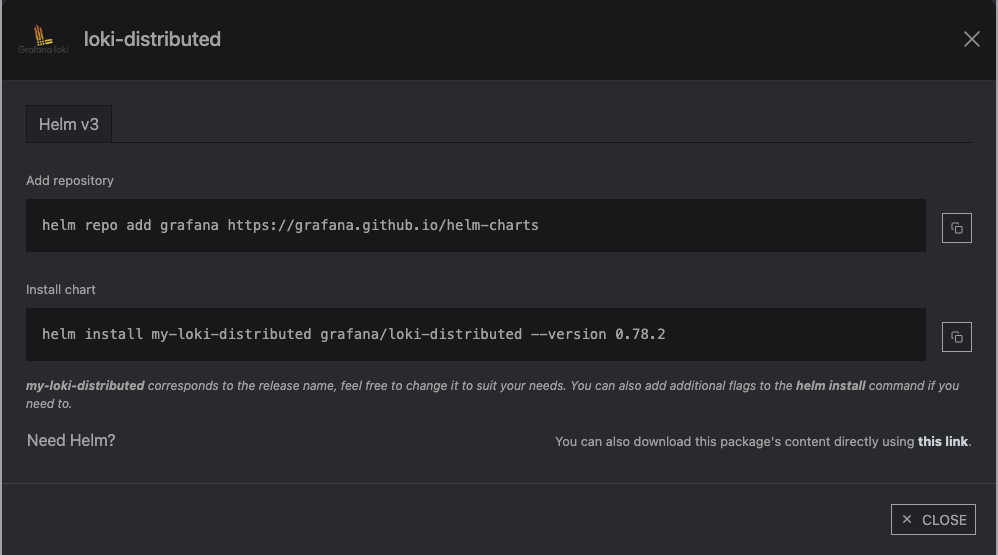

통상적으로 쿠버네티스의 로그 수집은 

**Elasticsearch를 Kibana로 시각화 하는 EFK 스택이 있고**

Loki를 Grafana로 시각화하는 PLG 스택이 있다

이번에는 Grafana를 사용하는 방법을 서술할 것이다.

1. [Loki Helm Chart](https://artifacthub.io/packages/helm/grafana/loki-distributed)를 쿠버네티스에 배포



```jsx
helm repo add grafana https://grafana.github.io/helm-charts
helm install my-loki-distributed grafana/loki-distributed --version 0.78.2
```

ArgoCD에 등록하는 것이 어떠한 것이 올라가 있고 배포되는지 보기 좋아서 ArgoCD로 배포하는 것을 선호한다.


드래그한 이름을 Argo App 이름에다가 기입


Grafana가 제공하는 모니터링 스택이 여러가지 있는데 SOURCE에서 배포 목록을 볼 수 있다.

SOURCE에서 loki-distributed(로그 보관 DB? + 에이전트?)를 선택하고 바로 오른쪽의 버전을 선택한다.

이후 똑같은 방법으로 목록에 보이는 Promtail(로그 수집기)을 배포한다.


`kubectl get svc --namespace=kube-system -l k8s-app=kube-dns  -o jsonpath='{.items..metadata.name}'` 명령어를 통해 나오는 DNS 이름을 기입한다

각 쿠버네티스(매니지드)마다 이름이 다를 수 있어 오버라이드로 이름을 맞춰준다.


values.yaml 오버라이드 - s3에 연결

```yaml
compactor:
  enabled: true
loki:
  structuredConfig:
    compactor:
      shared_store: s3
    ingester:
      max_transfer_retries: 0
      chunk_idle_period: 1h
      chunk_target_size: 1536000
      max_chunk_age: 1h
    schema_config:
      configs:
        - from: 2020-09-07
          store: boltdb-shipper
          object_store: s3
          schema: v11
          index:
            prefix: loki_index_
            period: 24h
    storage_config:
      boltdb_shipper:
        shared_store: s3
        active_index_directory: /var/loki/index
        cache_location: /var/loki/cache
        cache_ttl: 168h
      filesystem:
        directory: null
      aws:
        endpoint: https://kr.object.ncloudstorage.com
        region: kr-standard
        bucketnames: 버켓 이름
        access_key_id: 액세스 키 값
        secret_access_key: 시크릿 키 값
        s3forcepathstyle: true
        insecure: false
        sse_encryption: false
```

s3에 로그가 저장되는 모습


ArgoCD로 배포하면 배포가 된 것을 눈으로 확인할 수 있어서 파악하기 용이하다.


같은 방법으로 Promtail을 배포한다


이번에는 PARAMETERS를 변경하는 게 아닌 HELM의 VALUES에 오버라이드할 설정을 기재한다.

이러면 파일로 만들어서 -f 로 helm install 하는 것과 유사한 작동을 한다 (정확히는 다름)


여기 url에서는 loki의 push restapi url로 기재해야한다.

```jsx
config:
  clients:
    - url: http://loki-distributed-gateway.monitoring.svc:80/loki/api/v1/push
  enableTracing: true
  snippets:
    pipelineStages:
      - cri: {}
      #해당하는 네임스페이스 로그는 수집 안 함
      - drop:
          source:     "namespace"
          expression: "(argocd|default|grafana|kube-node-lease|kube-public|kube-system|prometheus)"
```


grafana의 커넥션, 데이터소스에서 loki를 등록한다.


여기서는 단순 url만 기재하면 된다.  `http://loki-distributed-gateway.monitoring.svc:80`


이러면 grafana에서 프로메테우스가 가져오는 메트릭 말고 pod의 log도 가져올 수 있다!


---

grafana진영의 promtail이 아닌 좀 더 쉬운

### [fluent bit](https://artifacthub.io/packages/helm/fluent/fluent-bit)로 loki에 로그 넣기

이번에는 EFK스택의 F만 훔쳐와서 바꿔 끼워보겠다.


아까와 같이 위 내용을 ArgoCD에 등록한다.


이번에 values는 restapi url이 아닌 그냥 dns url을 적으면 된다.

fleunt가 자체적으로 url맵핑이 되어있는 것 처럼 보인다.


~~(근데 사실 네임스페이스 다르게 배포함..)~~

```jsx
config:
  outputs: |
    [OUTPUT]
        Name loki
        Match kube.*
        Host  loki-distributed-gateway.monitoring.svc.cluster.local
        port        80
        labels                 job=fluentbit
        auto_kubernetes_labels on
```

이러면 loki에다가 로그를 넣는 기본 설정이 끝난다.

실제로 사용하기 위해서는 더 많은 커스텀 설정이 필요하다.

~~(이럴 바엔 EFK를 쓰고 OpenSearch를 grafana로 긁어오고 말지..)~~


loki에서 보면 promtail과 fleunt bit에서 보내는 데이터를 정상적으로 받았다는 로그를 확인할 수 있다.


---

grafana에서 추천하는 helm value

grafana for loki plugin 이미지 버전으로 커스텀 되었다.

```jsx
image:
  # Here we use the Docker image which has the plugin installed
  repository: grafana/fluent-bit-plugin-loki
  tag: main-e2ed1c0

args:
  - "-e"
  - "/fluent-bit/bin/out_grafana_loki.so"
  - --workdir=/fluent-bit/etc
  - --config=/fluent-bit/etc/conf/fluent-bit.conf

env:
  # Note that for security reasons you should fetch the credentials through a Kubernetes Secret https://kubernetes.io/docs/concepts/configuration/secret/ . You may use the envFrom for this.
  - name: FLUENT_LOKI_URL
    value: http://loki-distributed-gateway.{namespace}.svc.cluster.local/loki/api/v1/push

config:
  inputs: |
    [INPUT]
        Name tail
        Tag kube.*
        Path /var/log/containers/*.log
        # Be aware that local clusters like docker-desktop or kind use the docker log format and not the cri (https://docs.fluentbit.io/manual/installation/kubernetes#container-runtime-interface-cri-parser)
        multiline.parser docker, cri
        Mem_Buf_Limit 5MB
        Skip_Long_Lines On

  outputs: |
    [Output]
        Name grafana-loki
        Match kube.*
        Url ${FLUENT_LOKI_URL}
        Labels {job="fluent-bit"}
        LabelKeys level,app # this sets the values for actual Loki streams and the other labels are converted to structured_metadata https://grafana.com/docs/loki/latest/get-started/labels/structured-metadata/
        BatchWait 1
        BatchSize 1001024
        LineFormat json
        LogLevel info
        AutoKubernetesLabels true
```