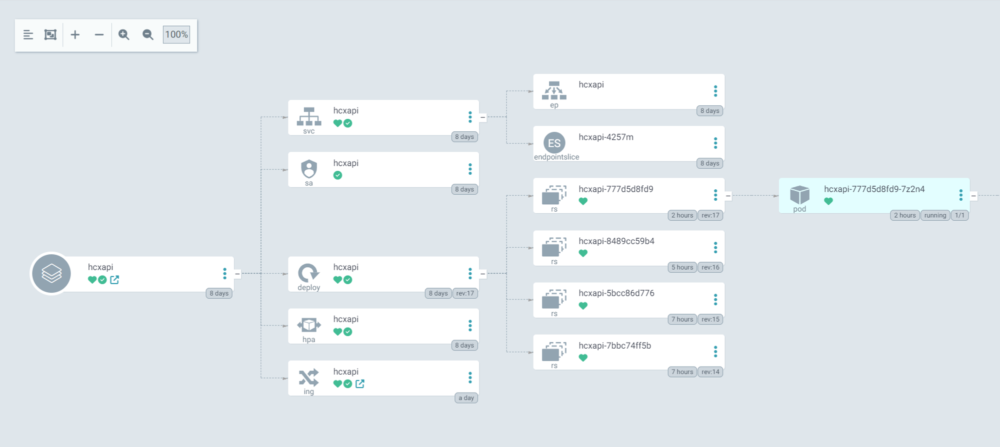

istio install 가이드: https://istio.io/latest/docs/setup/getting-started/#download

1. 최신 istio 버전 다운로드
    
    `curl -L https://istio.io/downloadIstio | sh -`
    
2. 폴더 이동
    
    `cd istio-1.19.3`
    
3. istioctl 바이너리를 환경 변수에 등록
    
    `export PATH=$PWD/bin:$PATH`
    
4. istio 설치
    
    `istioctl install --set profile=demo -y`
    
5. namespace에 label을 추가
    
    `kubectl label namespace default istio-injection=enabled`
    
    label의 역할은 해당 namespace에 생성되는 pod에 side-car 방식으로 envoy proxy pod가 추가됩니다.
    

실제 서비스에 필요한 쿠버네티스 컴포넌트

```bash
Deployment, Service 두 개가 필수이며

외부로 통신하기 위한 Ingress
오토 스케일링을 위한 HPA가 Helm create를 통해 기본 구성되어 생성됩니다.

Service Account는 Pod가 Kubernetes 권한을 갖거나 클라우드 IAM을 할당할 때 사용됩니다.
```



istio가 추가로 사용될 때 필요한 컴포넌트

```bash
Gateway
VirtualService

두 개가 필수로 붙어야 istio를 통해서 deployment와 service에 통신을 할 수 있습니다.

Gateway는 Istio가 생성한 LoadBalancer에서 들어오는 트래픽의 흐름을 제어하며
VirtualService는 Istio의 설정을 거쳐 쿠버네티스 Service에 도달하게 됩니다.

Destination Rule은 Pod에 도달하는 트래픽 비율과 
circuit breaker와 같은 기능으로 정상적으로 값을 전달받지 못하는 pod에 트래픽을 차단하는
istio 기능을 사용하는 컴포넌트입니다.
```

Rollouts = deployment와 동일 역할 (argo rollout 플러그인 기능)


예시 코드

```yaml
apiVersion: networking.istio.io/v1alpha3
kind: Gateway
metadata:
  name: bookinfo-gateway
spec:
  selector:
    istio: ingressgateway # istio ingress gateway(loadbalancer)에서 들어오는 트래픽 마치 ingressclassname 같은 문단
  servers:
  - port:
      number: 80
      name: http
      protocol: HTTP
    hosts: # ingress의 host와 같은 역할
    - kr.bookinfo.com
```

```yaml
apiVersion: networking.istio.io/v1alpha3
kind: VirtualService
metadata:
  name: reviews
spec:
  hosts:
  - reviews
  http:
  - match: # header에 해당 내용이 있으면 reviews v2로 라우팅
    - headers:
        end-user:
          exact: jackson
    route:
    - destination:
        host: reviews
        subset: v2
  - route: # 기본적으로 v3 라우팅
    - destination:
        host: reviews
        subset: v3
```

```yaml
apiVersion: networking.istio.io/v1alpha3
kind: DestinationRule
metadata:
  name: reviews
spec:
  host: reviews
  trafficPolicy:
    outlierDetection: # Circuit Breaker
      consecutiveErrors: 2 # 2번이상의 500대 에러 발생시
      interval: 1s
      baseEjectionTime: 3m # 3분간 트래픽 라우팅 제외
```