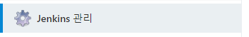
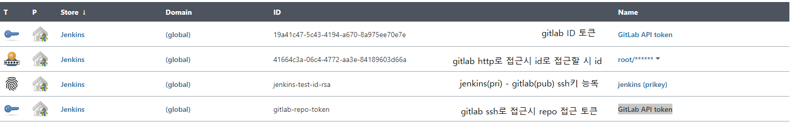
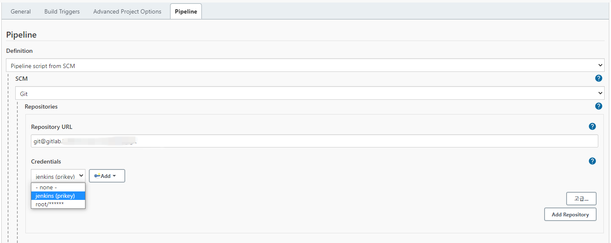

# jenkins

docker run -d —priviliged -p 8181:8080 -v /jenkins:/var/jenkins_home --name jenkins -u root jenkins/jenkins

젠킨스 접속 시 왼쪽에 젠킨스 관리에 들어가 시스템 설정 탭에 진입한다

2개의 Credentials가 필수적으로 필요하다.

1. gitlab 접근 토큰 
    1. 시스템 설정에서 gitlab 접근 값으로 사용
2. jenkins - gitlab 연동 ssh키 등록              
    1. jenkinsfile에서 credential id값으로 사용

(3). gitlab repo 접근 토큰    

1. jenkins 프로젝트 생성시 repo 접근 값으로 사용

(4). http로 repo에 접근할 때 gitlab id and pw

1. 시스템 설정 탭 안에 gitlab 설정 항목이 있는데 내부 gitlab의 url(도메인 혹은 IP)을 등록한다.

Credentials Add를 눌러 gitlab token을 등록한다.

gitlab에 로그인 후 Edit profile탭에 들어간다.

왼쪽 탭에 Access Tokens에 들어간다.

토큰의 이름과 유효기간과 권한을 설정후 발급한다.

페이지 상단에 토큰 값이 나오는데 이는 다시 볼 수 없음으로 잘 보관 혹은 바로 등록한다.

Credentials에 토큰 값을 입력하고 저장한다.

새로운 Item을 눌러 빌드할 환경을 만들 수 있다.

Pipeline으로 생성할 수 있다.

시스템 설정에서 등록한 gitlab과 연결할 수 있다.

아래 항목에 gitlab 저장소의 url을 가져오고 Credentials로 인증한다.

위 케이스는 이미지는 user and password로 인증하여 접근하였다.

프로젝트마다 토큰을 따로 발급하여 토큰으로 인증할 수 있다.

맨 아래에 gitlab 저장소 어디에 Jenkins script가 있는지 위치를 명시한다.
최상위 루트 폴더에 존재하기에 파일 명만 명시

프로젝트 생성 완료후 build now를 눌러 빌드한다.

1. ssh 키 등록

유저 프로필 설정 왼쪽 탭에 SSH KEYS를 눌러 ssh를 등록한다.

jenkins container의 `ssh-keygen -t rsa` 명령어로 ssh키를 생성후

`cat ~/.ssh/id_rsa.pub` 명령어로 pub파일 내용을 gitlab에 등록한다.

`cat ~/.ssh/id_rsa`

명령어로 나오는 모든 값을 jenkins설정의 Credentials 값에 등록한다.

이후에 이 값은 jenkinsfile 내에 Credentials ID에 들어간다.

1. 젠킨스 프로젝트 생성 ssh로 접근 시 Credentials 값에 (2) or (4) 에서 생성한 키를 등록한다.

이러한 과정을 통해 gitlab repo에 접근하여 소스를 pull 할 수 있다.

[helm install](jenins_helm/README.md)

[jenkinsfile 모음](https://www.notion.so/jenkinsfile-5d8ed8522aab434bbe23f428745f93d4?pvs=21)