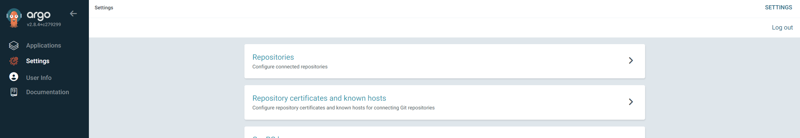

# logging

### OpenSearch helm chart install

CLI로 Helm install [chart name] [chart] 명령어로 배포할 수도 있지만

argoCD Setting - Repositories에서 Helm Chart를 추가할 수도 있다



CONNECT REPO를 클릭하여 Chart Repo를 추가한다.


Add repository에 있는 URL을 복사한다.


```yaml
https://opensearch-project.github.io/helm-charts
opensearch
```

HTTPS로 받아오고, type: Helm으로 설정하고

Name은 임의의 구분할 이름을 적고

Project는 따로  분리한 것이 없으므로 기본값 default가 선택된다

Repository URL에 위에서 복사한 URL을 기입한다.


Repo가 등록된 것을 확인할 수 있으며 오른쪽 점 3개를 클릭하여 Create application을 클릭한다.


위에 Install Chart Name에 Chart Name만 복사해와서 argoCD Application Name에 기입한다.

이유는 Chart Name이 다르면 Chart Name이 한 번 더 추가로 붙기 때문에 보기가 난잡해진다.


해당 URL에서 받아올 수 있는 Chart들이 Source 항목에 표시된다.


Chart와 버전을 선택해야 정상적으로 Chart를 설치하고 values 값을 변경할 수 있다.


자기 자신의 Cluster에 설치할 것이며, Namespace: monitoring 에 배포할 것이다.

Namespace가 비어있으면 오류가 발생하므로, defualt에 배포하고 싶어도 default라 명시해야 한다.


제일 아래에는 values.yaml 값을 변경할 수 있는 섹션이다.

values를 변경하거나 VALUES 항목에 직접 custom-values.yaml을 적어 넣을 수 있다.


사용한 values 값

```yaml
singleNode: true
```

—app—

배포 후에 해당 app에 들어가서 APP DETAILS - PARAMETERS로 Values 값을 수정할 수 있다.


PARAMETERS에는 Values.yaml에 적혀있는 값들이 불러와지며 이 값을 수정함으로 values.yaml 수정한 것과 같은 동작을 한다.


parameter만 바꾸기에는 너무 번거롭고 values에서 주석 처리 되어있는 값들은 수정할 수 없기에

VALUES 항목에 직접 custom-values.yaml을 적어 넣을 수 있다.


---

### O**pensearch-dashboard 배포**

같은 Chart URL에 있음으로 Chart값만 변경하여 배포한다.


사용한 values 값

```yaml
ingress:
  enabled: true
  ingressClassName: nginx
  annotations: {}
    # kubernetes.io/ingress.class: nginx
    # kubernetes.io/tls-acme: "true"
  labels: {}
  hosts:
    - host: opensearch.didimdev.kro.kr
      paths:
        - path: /
          backend:
            serviceName: ""
            servicePort: ""
  tls: []
  #  - secretName: chart-example-tls
  #    hosts:
  #      - chart-example.local
```

OpenSearch에 Ingress로 접근할 수 있으며 

기본 계정은 admin/admin과 kibanaserver/kibanaserver 가 존재한다.


---

### Fluent bit 배포

위와 마찬가지로 argoCD Repo에 Fluent bit를 등록한다.


repo 등록


app 생성


chart를 선택하고 같은 namespace에 배포한다.


VALUE 항목에 아래 설정을 추가하여 배포한다.

```yaml
config:
  customParsers: |
    [PARSER]
        Name docker_no_time
        Format json
        Time_Keep Off
        Time_Key time
        Time_Format %Y-%m-%dT%H:%M:%S.%L

    [MULTILINE_PARSER]
        name          my_multiline_parser
        type          regex
        flush_timeout 1000
        rule          "start_state"   "/^\[\d{2}\/[A-Za-z]+\/\d{4} \d{2}:\d{2}:\d{2}\]/"  "cont"
        rule          "cont"          "/^(?!\\[\d{2}\/[A-Za-z]+\/\d{4} \d{2}:\d{2}:\d{2}\\]).*/"  "cont"

    [MULTILINE_PARSER]
        name          multiline-regex-test
        type          regex
        flush_timeout 1000
        # rules |   state name  | regex pattern                  | next state
        # ------|---------------|--------------------------------------------
        rule      "start_state"   "/(Dec \d+ \d+\:\d+\:\d+)(.*)/"  "cont"
        rule      "cont"          "/^\s+at.*/"                     "cont"

  inputs: |
    [INPUT]
        Name tail
        Path /var/log/containers/*.log
        multiline.parser docker, cri
        Tag kube.*
        Mem_Buf_Limit 5MB
        Skip_Long_Lines On

    [INPUT]
        Name systemd
        Tag host.*
        Systemd_Filter _SYSTEMD_UNIT=kubelet.service
        Read_From_Tail On

  filters: |
    [FILTER]
        Name kubernetes
        Match kube.*
        Merge_Log On
        Keep_Log Off
        K8S-Logging.Parser On
        K8S-Logging.Exclude On

    [FILTER]
        Name              grep
        Match             kube.*
        Exclude           $kubernetes['namespace_name'] kube-system
        Exclude           $kubernetes['namespace_name'] kube-public
        Exclude           $kubernetes['namespace_name'] monitoring
        Exclude           $kubernetes['namespace_name'] cert-manager
        Exclude           $kubernetes['namespace_name'] kube-node-lease
        Exclude           $kubernetes['container_name'] querynode

    [FILTER]
        name                  multiline
        match                 *
        multiline.key_content log
        multiline.parser      multiline-regex-test, my_multiline_parser

  outputs: |
    [OUTPUT]
        Name opensearch
        Match kube.*
        Host opensearch-cluster-master
        http_user admin
        http_passwd admin
        Logstash_Format On
        Retry_Limit     False
        Type            flb_type
        Time_Key        @timestamp
        Replace_Dots    On
        Logstash_Prefix backend
        tls     On
        tls.verify off
        tls.debug 4
        Index fluentbit
        Suppress_Type_Name On
```

설정 값 의

```
노드의 docker 로그에 저장되는 파일명은 
kube.* 로 시작하는 것을 가져올 것이고

opensearch-cluster-master라는 URL에 전송할 것이고

해당 URL의     id/pw는 admin이고 
시간은         @timestamp을 사용할 것이고

_type이라는 문법을 최신버전의 opensearch에서는 제거되었으니
호환되는 문법을 맞춰주겠다는 설정으로 Suppress_Type_Name On 를 설정한다.
```

Dashboards Management 에서 Index Patterns를 관리할 수 있으며


쿠버네티스에서 추출한 로그들이 Logstash_Prefix 에 설정된 이름으로 주고 받고 있다.


backend-*로 시작하는 로그들을 전부 가져오겠다라는 인덱스 패턴을 생성한다.


discover 항목에서 로그가 들어오는 것을 확인할 수 있다.


