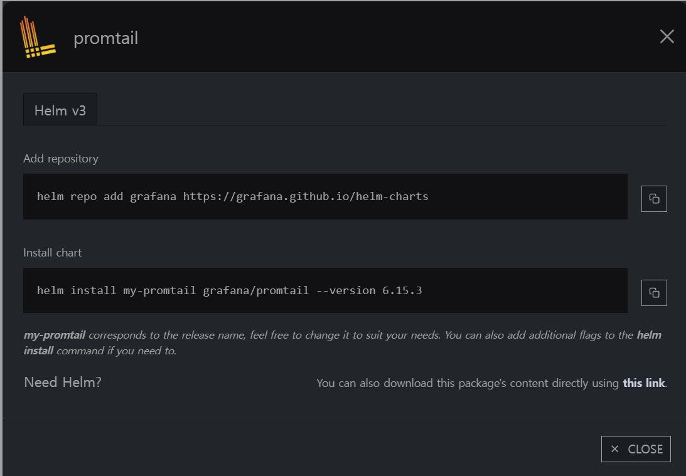

# promtail loki

promtail



values.yaml

```yaml
config:
  clients:
    - url: http://loki-distributed-gateway.grafana.svc:80/loki/api/v1/push
  enableTracing: true
  snippets:
    pipelineStages:
      - cri: {}
      #해당하는 네임스페이스 로그는 수집 안 함
      - drop:
          source:     "namespace"
          expression: "(appofapps|argocd|cert-manager|default|gitlab|grafana|jupyter|kube-node-lease|kube-public|kube-system|kubecost|logging|otel|prometheus)"
```

---

### **loki-distributed**


values

```yaml
compactor:
  enabled: true
loki:
  structuredConfig:
    compactor:
      shared_store: s3
    ingester:
      max_transfer_retries: 0
      chunk_idle_period: 1h
      chunk_target_size: 1536000
      max_chunk_age: 1h
    schema_config:
      configs:
        - from: 2020-09-07
          store: boltdb-shipper
          object_store: s3
          schema: v11
          index:
            prefix: loki_index_
            period: 24h
    storage_config:
      boltdb_shipper:
        shared_store: s3
        active_index_directory: /var/loki/index
        cache_location: /var/loki/cache
        cache_ttl: 168h
      filesystem:
        directory: null
      aws:
        endpoint: https://kr.object.ncloudstorage.com
        region: kr-standard
        bucketnames: 버켓 이름
        access_key_id: 액세스 키 값
        secret_access_key: 시크릿 키 값
        s3forcepathstyle: true
        insecure: false
        sse_encryption: false
```

---

### grafana


loki gateway url에 맞추어서 지정


로그가 수집되는 것을 확인할 수 있음