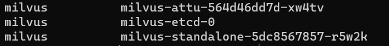
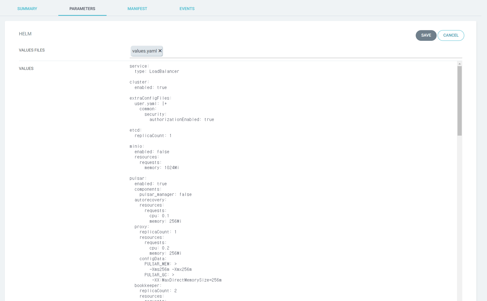

기본 설치 가이드 문서: https://milvus.io/docs/install_cluster-milvusoperator.md

EKS 설치 문서(S3 사용): https://milvus.io/docs/eks.md

Milvus DB Helm 설치

cluster 모드로 설치하기

```bash
cat << EOF > custom.yaml
cluster:
  enabled: true

# RBAC 활성화
extraConfigFiles:
  user.yaml: |+
    common:
      security:
        authorizationEnabled: true

etcd:
  replicaCount: 1

#설치형 s3 사용 안함 default: true
minio:
  enabled: false
  resources:
    requests:
      memory: 1024Mi

pulsar:
  enabled: true
  components:
    pulsar_manager: false
  autorecovery:
    resources:
      requests:
        cpu: 0.1
        memory: 256Mi
  proxy:
    replicaCount: 1
    resources:
      requests:
        cpu: 0.2
        memory: 256Mi
    configData:
      PULSAR_MEM: >
        -Xms256m -Xmx256m
      PULSAR_GC: >
         -XX:MaxDirectMemorySize=256m
  bookkeeper:
    replicaCount: 2
    resources:
      requests:
        cpu: 0.2
        memory: 512Mi
    configData:
      PULSAR_MEM: >
        -Xms512m -Xmx512m
      PULSAR_GC: >
        -XX:MaxDirectMemorySize=512m
        -Dio.netty.leakDetectionLevel=disabled
        -Dio.netty.recycler.linkCapacity=1024
        -XX:+UseG1GC -XX:MaxGCPauseMillis=10
        -XX:+ParallelRefProcEnabled
        -XX:+UnlockExperimentalVMOptions
        -XX:+DoEscapeAnalysis -XX:ParallelGCThreads=32
        -XX:ConcGCThreads=32 -XX:G1NewSizePercent=50
        -XX:+DisableExplicitGC
        -XX:-ResizePLAB
        -XX:+ExitOnOutOfMemoryError
        -XX:+PerfDisableSharedMem
        -XX:+PrintGCDetails
  zookeeper:
    replicaCount: 1
    resources:
      requests:
        cpu: 0.1
        memory: 256Mi
    configData:
      PULSAR_MEM: >
        -Xms256m
        -Xmx256m
      PULSAR_GC: >
        -Dcom.sun.management.jmxremote
        -Djute.maxbuffer=10485760
        -XX:+ParallelRefProcEnabled
        -XX:+UnlockExperimentalVMOptions
        -XX:+DoEscapeAnalysis -XX:+DisableExplicitGC
        -XX:+PerfDisableSharedMem
        -Dzookeeper.forceSync=no
  broker:
    replicaCount: 1
    resources:
      requests:
        cpu: 0.2
        memory: 512Mi
    configData:
      PULSAR_MEM: >
        -Xms512m
        -Xmx512m
      PULSAR_GC: >
        -XX:MaxDirectMemorySize=512m
        -Dio.netty.leakDetectionLevel=disabled
        -Dio.netty.recycler.linkCapacity=1024
        -XX:+ParallelRefProcEnabled
        -XX:+UnlockExperimentalVMOptions
        -XX:+DoEscapeAnalysis
        -XX:ParallelGCThreads=32
        -XX:ConcGCThreads=32
        -XX:G1NewSizePercent=50
        -XX:+DisableExplicitGC
        -XX:-ResizePLAB
        -XX:+ExitOnOutOfMemoryError

  monitoring:
    prometheus: true
    grafana: true
    node_exporter: true
    alert_manager: false

  grafana:
    service:
      type: ClusterIP
    ingress:
      enabled: true
      annotations: {}
       ## cert-manager.io/issuer: letsencrypt-prod
      tls: []
      ## - secretName: ""
      hostname: "grafana.srrain.kro.kr"
      path: /
      port: 3000

#클라우드 S3 사용
externalS3:
  enabled: true
  host: "kr.object.ncloudstorage.com"
  port: "80"
  accessKey: "{액세스키 삭제}"
  secretKey: "{시크릿키 삭제}"
  bucketName: "milvus-s3"
  cloudProvider: "aws"

#관리 페이지 사용
attu:
  enabled: true
  ingress:
    enabled: true
    annotations:
      cert-manager.io/issuer: letsencrypt-prod
    hosts:
      - milvus-attu.srrain.kro.kr
    tls:
    - hosts:
      - milvus-attu.srrain.kro.kr
      secretName: milvus-attu

#ingress 활성화
ingress:
  enabled: true
  annotations:
    cert-manager.io/issuer: letsencrypt-prod
    nginx.ingress.kubernetes.io/backend-protocol: GRPC
    nginx.ingress.kubernetes.io/listen-ports-ssl: '[19530]'
    nginx.ingress.kubernetes.io/proxy-body-size: 4m
    nginx.ingress.kubernetes.io/ssl-redirect: "true"
  labels: {}
  rules:
    - host: "milvus.srrain.kro.kr"
      path: "/"
      pathType: "Prefix"
  tls:
  - hosts:
    - milvus.srrain.kro.kr
    secretName: milvus

EOF
```

- Stand alone
    
    ```bash
    helm repo add milvus https://raw.githubusercontent.com/milvus-io/milvus-helm/gh-pages
    helm fetch milvus/milvus --untar
    
    cd milvus
    cat << EOF > custom.yaml
    
    #Standalone 모드
    cluster:
      enabled: false
    
    #RBAC 활성화 
    extraConfigFiles:
      user.yaml: |+
        common:
          security:
            authorizationEnabled: true
    etcd:
      replicaCount: 1
    
    #메시지 대기열 사용 안함
    pulsar:
      enabled: false
    
    #설치형 s3 사용 안함
    minio:
      enabled: false
      mode: standalone
    
    #클라우드 S3 사용
    externalS3:
      enabled: true
      host: "kr.object.ncloudstorage.com"
      port: "80"
      accessKey: "{액세스키 삭제}"
      secretKey: "{시크릿키 삭제}"
      bucketName: "milvus-s3"
      cloudProvider: "aws"
    
    #관리 페이지 사용
    attu: 
      enabled: true
      ingress:
        enabled: true
        annotations:
          cert-manager.io/issuer: letsencrypt-prod
        hosts:
          - milvus-attu.srrain.kro.kr
        tls:
        - hosts:
          - milvus-attu.srrain.kro.kr
          secretName: milvus-attu
    
    #ingress 활성화
    ingress:
      enabled: true
      annotations:
        cert-manager.io/issuer: letsencrypt-prod
        nginx.ingress.kubernetes.io/backend-protocol: GRPC
        nginx.ingress.kubernetes.io/listen-ports-ssl: '[19530]'
        nginx.ingress.kubernetes.io/proxy-body-size: 4m
        nginx.ingress.kubernetes.io/ssl-redirect: "true"
      labels: {}
      rules:
        - host: "milvus.srrain.kro.kr"
          path: "/"
          pathType: "Prefix"
      tls:
      - hosts:
        - milvus.srrain.kro.kr
        secretName: milvus
    
    EOF
    ```
    

Helm 배포

```bash
helm upgrade --install milvus . -f custom.yaml -n milvus --create-namespace
```

(Stand alone 모드)


---

## argoCD로 배포하기

- cluster 모드 url: srrain.kro.kr
    
    ```yaml
    cluster:
      enabled: true
    
    extraConfigFiles:
      user.yaml: |+
        common:
          security:
            authorizationEnabled: true
    
    etcd:
      replicaCount: 1
    
    minio:
      enabled: false
      resources:
        requests:
          memory: 1024Mi
    
    pulsar:
      enabled: true
      components:
        pulsar_manager: false
      autorecovery:
        resources:
          requests:
            cpu: 0.1
            memory: 256Mi
      proxy:
        replicaCount: 1
        resources:
          requests:
            cpu: 0.2
            memory: 256Mi
        configData:
          PULSAR_MEM: >
            -Xms256m -Xmx256m
          PULSAR_GC: >
             -XX:MaxDirectMemorySize=256m
      bookkeeper:
        replicaCount: 2
        resources:
          requests:
            cpu: 0.2
            memory: 512Mi
        configData:
          PULSAR_MEM: >
            -Xms512m -Xmx512m
          PULSAR_GC: >
            -XX:MaxDirectMemorySize=512m
            -Dio.netty.leakDetectionLevel=disabled
            -Dio.netty.recycler.linkCapacity=1024
            -XX:+UseG1GC -XX:MaxGCPauseMillis=10
            -XX:+ParallelRefProcEnabled
            -XX:+UnlockExperimentalVMOptions
            -XX:+DoEscapeAnalysis -XX:ParallelGCThreads=32
            -XX:ConcGCThreads=32 -XX:G1NewSizePercent=50
            -XX:+DisableExplicitGC
            -XX:-ResizePLAB
            -XX:+ExitOnOutOfMemoryError
            -XX:+PerfDisableSharedMem
            -XX:+PrintGCDetails
      zookeeper:
        replicaCount: 1
        resources:
          requests:
            cpu: 0.1
            memory: 256Mi
        configData:
          PULSAR_MEM: >
            -Xms256m
            -Xmx256m
          PULSAR_GC: >
            -Dcom.sun.management.jmxremote
            -Djute.maxbuffer=10485760
            -XX:+ParallelRefProcEnabled
            -XX:+UnlockExperimentalVMOptions
            -XX:+DoEscapeAnalysis -XX:+DisableExplicitGC
            -XX:+PerfDisableSharedMem
            -Dzookeeper.forceSync=no
      broker:
        replicaCount: 1
        resources:
          requests:
            cpu: 0.2
            memory: 512Mi
        configData:
          PULSAR_MEM: >
            -Xms512m
            -Xmx512m
          PULSAR_GC: >
            -XX:MaxDirectMemorySize=512m
            -Dio.netty.leakDetectionLevel=disabled
            -Dio.netty.recycler.linkCapacity=1024
            -XX:+ParallelRefProcEnabled
            -XX:+UnlockExperimentalVMOptions
            -XX:+DoEscapeAnalysis
            -XX:ParallelGCThreads=32
            -XX:ConcGCThreads=32
            -XX:G1NewSizePercent=50
            -XX:+DisableExplicitGC
            -XX:-ResizePLAB
            -XX:+ExitOnOutOfMemoryError
    
      monitoring:
        prometheus: true
        grafana: true
        node_exporter: true
        alert_manager: false
    
      grafana:
        service:
          type: ClusterIP
        ingress:
          enabled: true
          annotations: {}
           ## cert-manager.io/issuer: letsencrypt-prod
          tls: []
          ## - secretName: ""
          hostname: "grafana.srrain.kro.kr"
          path: /
          port: 3000
    
    externalS3:
      enabled: true
      host: "kr.object.ncloudstorage.com"
      port: "80"
      accessKey: "{액세스키 삭제}"
      secretKey: "{시크릿키 삭제}"
      bucketName: "milvus-s3"
      cloudProvider: "aws"
    
    attu:
      enabled: true
      ingress:
        enabled: true
        annotations:
          cert-manager.io/issuer: letsencrypt-prod
        hosts:
          - milvus-attu.srrain.kro.kr
        tls:
        - hosts:
          - milvus-attu.srrain.kro.kr
          secretName: milvus-attu
    
    ingress:
      enabled: true
      annotations:
        cert-manager.io/issuer: letsencrypt-prod
        nginx.ingress.kubernetes.io/backend-protocol: GRPC
        nginx.ingress.kubernetes.io/listen-ports-ssl: '[19530]'
        nginx.ingress.kubernetes.io/proxy-body-size: 4m
        nginx.ingress.kubernetes.io/ssl-redirect: "true"
      labels: {}
      rules:
        - host: "miluvs.srrain.kro.kr"
          path: "/"
          pathType: "Prefix"
      tls:
      - hosts:
        - miluvs.srrain.kro.kr
        secretName: milvus-ai
    
    ```
    

argocd → Settings → Repositories에서 Helm Chart URL을 등록할 수 있다.

Milvus Helm: https://raw.githubusercontent.com/milvus-io/milvus-helm/gh-pages을 등록한다.


NEW APP 버튼을 클릭하여 새로운 argoCD App을 등록한다


위에서 등록한 milvus를 Source로 등록하고 배포될 Cluster를 선택 후 namespaec를 기재한다.


위에 custom.yaml을 VALUES에 그대로 복사 붙여넣기 한다.



Milvus가 Proxy Protocol이 지원이 되지 않는 이슈로 간단하게 LoadBalancer 로 배포하였다.

- parameter - values
    
    ```bash
    service:
      type: LoadBalancer
    
    cluster:
      enabled: true
    
    extraConfigFiles:
      user.yaml: |+
        common:
          security:
            authorizationEnabled: true
    
    etcd:
      replicaCount: 1
    
    minio:
      enabled: false
      resources:
        requests:
          memory: 1024Mi
    
    pulsar:
      enabled: true
      components:
        pulsar_manager: false
      autorecovery:
        resources:
          requests:
            cpu: 0.1
            memory: 256Mi
      proxy:
        replicaCount: 1
        resources:
          requests:
            cpu: 0.2
            memory: 256Mi
        configData:
          PULSAR_MEM: >
            -Xms256m -Xmx256m
          PULSAR_GC: >
             -XX:MaxDirectMemorySize=256m
      bookkeeper:
        replicaCount: 2
        resources:
          requests:
            cpu: 0.2
            memory: 512Mi
        configData:
          PULSAR_MEM: >
            -Xms512m -Xmx512m
          PULSAR_GC: >
            -XX:MaxDirectMemorySize=512m
            -Dio.netty.leakDetectionLevel=disabled
            -Dio.netty.recycler.linkCapacity=1024
            -XX:+UseG1GC -XX:MaxGCPauseMillis=10
            -XX:+ParallelRefProcEnabled
            -XX:+UnlockExperimentalVMOptions
            -XX:+DoEscapeAnalysis -XX:ParallelGCThreads=32
            -XX:ConcGCThreads=32 -XX:G1NewSizePercent=50
            -XX:+DisableExplicitGC
            -XX:-ResizePLAB
            -XX:+ExitOnOutOfMemoryError
            -XX:+PerfDisableSharedMem
            -XX:+PrintGCDetails
      zookeeper:
        replicaCount: 1
        resources:
          requests:
            cpu: 0.1
            memory: 256Mi
        configData:
          PULSAR_MEM: >
            -Xms256m
            -Xmx256m
          PULSAR_GC: >
            -Dcom.sun.management.jmxremote
            -Djute.maxbuffer=10485760
            -XX:+ParallelRefProcEnabled
            -XX:+UnlockExperimentalVMOptions
            -XX:+DoEscapeAnalysis -XX:+DisableExplicitGC
            -XX:+PerfDisableSharedMem
            -Dzookeeper.forceSync=no
      broker:
        replicaCount: 1
        resources:
          requests:
            cpu: 0.2
            memory: 512Mi
        configData:
          PULSAR_MEM: >
            -Xms512m
            -Xmx512m
          PULSAR_GC: >
            -XX:MaxDirectMemorySize=512m
            -Dio.netty.leakDetectionLevel=disabled
            -Dio.netty.recycler.linkCapacity=1024
            -XX:+ParallelRefProcEnabled
            -XX:+UnlockExperimentalVMOptions
            -XX:+DoEscapeAnalysis
            -XX:ParallelGCThreads=32
            -XX:ConcGCThreads=32
            -XX:G1NewSizePercent=50
            -XX:+DisableExplicitGC
            -XX:-ResizePLAB
            -XX:+ExitOnOutOfMemoryError
    
      monitoring:
        prometheus: true
        grafana: true
        node_exporter: true
        alert_manager: false
    
      grafana:
        service:
          type: ClusterIP
        ingress:
          enabled: true
          annotations: {}
           ## cert-manager.io/issuer: letsencrypt-prod
          tls: []
          ## - secretName: ""
          hostname: "grafana.srrain.kro.kr"
          path: /
          port: 3000
    
    externalS3:
      enabled: true
      host: "kr.object.ncloudstorage.com"
      port: "80"
      accessKey: "{액세스키 삭제}"
      secretKey: "{시크릿키 삭제}"
      bucketName: "milvus-s3"
      cloudProvider: "aws"
    
    attu:
      enabled: true
      ingress:
        enabled: true
        hosts:
          - milvus-attu.srrain.kro.kr
        tls: []
        # - hosts:
        #   - milvus-attu.srrain.kro.kr
        #   secretName: milvus-attu
    
    ingress:
      enabled: true
      annotations:
        cert-manager.io/issuer: letsencrypt-prod
        nginx.ingress.kubernetes.io/backend-protocol: GRPC
        nginx.ingress.kubernetes.io/listen-ports-ssl: '[19530]'
        nginx.ingress.kubernetes.io/proxy-body-size: 4m
        nginx.ingress.kubernetes.io/ssl-redirect: "true"
      labels: {}
      rules:
        - host: "milvus.srrain.kro.kr"
          path: "/"
          pathType: "Prefix"
      tls:
      - hosts:
        - milvus.srrain.kro.kr
        secretName: milvus-ai
    ```
    

argoCD에 Milvus가 배포된 것을 볼 수 있다.


---

### Milvus Backup

> 참조: https://milvus.io/docs/milvus_backup_cli.md
> 

1. 백업 툴을 다운받는다.
    
    ```yaml
    #폴더 생성 및 디렉토리 이동
    mkdir workspace && cd workspace
    
    #압축파일 다운로드
    wget https://github.com/zilliztech/milvus-backup/releases/download/v0.4.1/milvus-backup_Linux_x86_64.tar.gz
    
    #압축해제
    tar -zxvf milvus-backup_Linux_x86_64.tar.gz
    
    #실행 권한 추가
    chmod +x milvus-backup
    ```
    
2. 실행 구조에 맞추어 폴더를 생성한다.
    
    ```yaml
    workspace
    ├── milvus-backup
    └── configs
         └── backup.yaml
    
    mkdir configs
    ```
    
3. example config 파일을 로컬로 다운받는다.
    
    ```yaml
    wget https://raw.githubusercontent.com/zilliztech/milvus-backup/master/configs/backup.yaml
    
    #파일 잘라내기 & 붙여넣기
    mv backup.yaml configs
    ```
    
4. config 파일 수정
    
    ```yaml
    milvus:
      address: milvus.srrain.kro.kr
      port: 19530
      authorizationEnabled: true #로그인 기능 활성화 했는지에 따라서 true
      tlsMode: 0
      user: "root"
      password: "Milvus"
    
    #minio대신 Object Storage를 사용중으로 Object Storage에 대한 정보를 기재
    minio:
      cloudProvider: "aws" 
    
      address: kr.object.ncloudstorage.com # Object Storage Endpoint
      port: 80  # 기본 포트 80
      accessKeyID: 12354364586345690 # Object Storage에 쓰기 권한이 있는 유저의 키
      secretAccessKey: 123905325893467895467
      useSSL: false 
      useIAM: false
      iamEndpoint: ""
    
      bucketName: "milvus-s3" # 현재 Milvus가 사용중인 버킷 이름
      rootPath: "" # 현재 사용중인 Milvus 버켓의 rootpath(value에는 빈 값으로 사용했음)
    
      backupBucketName: "milvus-s3-backup" #백업본을 생성할 버킷 이름
      backupRootPath: "backup" # Rootpath to store backup data. Backup data will store to backupBucketName/backupRootPath
    ```
    
5. 백업 실행
    
    ```yaml
    ./milvus-backup create -n hcx #백업을 구분할 이름
    ```
    
6. 확인
    1. backup이라는 최상위 폴더가 생성됨
        
        
        
    2. hcx 이름의 백업 폴더가 생성됨 
        
        
        
    
7. restore 실행
    1. -n {백업 이름} -s {milvus collection에 추가로 붙는 이름}
    
    ```yaml
    ./milvus-backup restore -n hcx -s _recover
    ```
    
    ```yaml
    collection_01이 원래 이름이였을 경우
    collection_01_recover로 Collection이 하나 더 생성됨
    ```
    

### 다른 클라우드 계정에 백업과 복원을 하는 방법

설명

```yaml
rclone 도구를 활용하여 
a계정의 버킷 <-> b계정의 버킷을 복사한다.
```

1. rclone 설치 및 활용

```yaml
curl https://rclone.org/install.sh | sudo bash
rclone config

config: n # 새로운 config 생성)
name: abucket # 구분할 이름
storage: 5 # s3
provider: 24 # aws
env_auth: 1 # 액세스 시크릿키 사용 유무
access_key_id: #액세스 키 입력
secret_key_id: #시크릿 키 입력
region: 1
endpoint: kr.object.ncloudstorage.com
location_constraint: "" #빈 값
acl: "" #빈값
edit advanced config: n #고급 설정 안 함
keep this "remote name" remote?: y # 설정 저장

2번 실행하여 a계정과 b계정을 등록

#밀버스 백업을 받은 s3를 b계정의 버킷으로 복사
rclone copy test:milvus-s3-backup new-test:milvus-s3-backup
```

1. config파일 변경

```yaml
milvus:
  address: milvus.srrain.kro.kr #새로운 milvus url
  port: 19530
  authorizationEnabled: true
  tlsMode: 0
  user: "root"
  password: "Milvus"

minio:
  cloudProvider: "aws" 

  address: kr.object.ncloudstorage.com # Object Storage Endpoint
  port: 80  # 기본 포트 80
  accessKeyID: 123456 # b계정의 인증키 입력
  secretAccessKey: 654312 
  useSSL: false 
  useIAM: false
  iamEndpoint: ""

  bucketName: "new-milvus-s3" # 새로운 Milvus에서 사용하고 있는 버켓 이름
  rootPath: "files" # 새로운 Milvus 버켓의 rootpath 

  backupBucketName: "milvus-s3-backup" # b계정으로 받아온 백업이 있는 버켓
  backupRootPath: "backup" # Rootpath to store backup data. Backup data will store to backupBucketName/backupRootPath
```

1. restore 실행

```yaml
./milvus-backup restore -n hcx #백업을 구분한 이름
```

---

240108 추가

milvus의 etcd의 개수를 증가시키려면 클러스터 상태를 변경해야함

```yaml
etcd:
  replicaCount: 3
  initialClusterState: existing
```

참고: https://docs.veertu.com/anka/anka-build-cloud/troubleshooting/etcd/etcd-cluster-id-mismatch/

---

+++ 추가
Coordinator들의 이중화를 하려면 activeStandby가 무조건 활성화 되어야 replicas를 확장시켜 사용할 수 있다.
```yaml
dataCoordinator:
  activeStandby:
    enabled: True
  replicas: 2

queryCoordinator:
  activeStandby:
    enabled: True
  replicas: 2

rootCoordinator:
  activeStandby:
    enabled: True
  replicas: 2
```


+++ 추가
Coordinator들의 이중화를 하려면 activeStandby가 무조건 활성화 되어야 replicas를 확장시켜 사용할 수 있다.