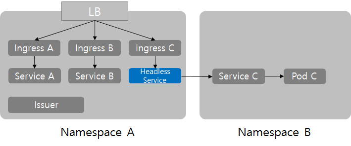

# nginx ingress

#helm install

```bash
helm repo add ingress-nginx https://kubernetes.github.io/ingress-nginx
helm install ingress-nginx ingress-nginx/ingress-nginx --version 4.4.0 -n ingress-nginx --create-namespace
```

#default ingress class로 사용하기

```bash
kubectl patch ingressclass nginx \
  --patch '{"metadata":{"annotations":{"ingressclass.kubernetes.io/is-default-class":"true"}}}'
```

#ingress yaml

```yaml
apiVersion: networking.k8s.io/v1
kind: Ingress
metadata:
  name: ingress-example
  namespace: default
spec:
  ingressClassName: nginx #nginx끼리 구분
  rules:
    #- host: www.example.com #접속할 도메인 이름 로컬에서 테스트할 때는 가짜로 넣고 hosts파일 수정해도 됨
      http:
        paths:
          - pathType: Prefix
            backend:
              service:
                name: gitea-http #쿠버네티스 svc 명
                port:
                  number: 3000 # svc ClusterIP 포트
            path: /
  # This section is only required if TLS is to be enabled for the Ingress
  # TLS 필요하면 secret에 tls정보 넣어서 미리 생성해둔 secret 참조
  tls:
  - hosts:
    - www.example.com
    secretName: example-tls
```

```yaml
apiVersion: v1
kind: Secret
metadata:
  name: example-tls
  namespace: default
data:
  tls.crt: <base64 encoded cert>
  tls.key: <base64 encoded key>
type: kubernetes.io/tls
```

일단 기본적으로 ingress는 같은 네임스페이스에서만 참조하여 동작함

```yaml
- backend:
    serviceName: servceC.namespaceB.svc.cluster.local  # k8s style reference
    servicePort: 80
```

이런식으로 다른 네임스페이스의 서비스를 참조할 수 없음

다른 네임스페이스를 참조하는 sevice를 생성해서 ingress를 잇는 방법으로 동작시킬 수는 있음


```yaml
apiVersion: v1
kind: Service
metadata:
  annotations:
    name: headless-to-serviceC
    namespace: namespaceA
spec:
  clusterIP: None
  externalName: serviceC.namespaceB.svc.cluster.local# reference svc-C in ns-B
```

```yaml
apiVersion: extensions/v1beta1
kind: Ingress
metadata:
  annotations:
    cert-manager.io/issuer: namespaceA-issuer
    kubernetes.io/ingress.class: nginx
  name: ingressC
  namespace: namespaceA
spec:
  rules:
  - host: subdomain.host.com
    http:
      paths:
      - path: /
        backend:
          serviceName: headless-to-serviceC
          servicePort: 80
```

[다른 namespace svc에 ingress 설정](nginx-ingress_img/다른%20namespace%20svc에%20ingress%20설정%2069fdd495576c465e99a88654c8297bb2/README.md)