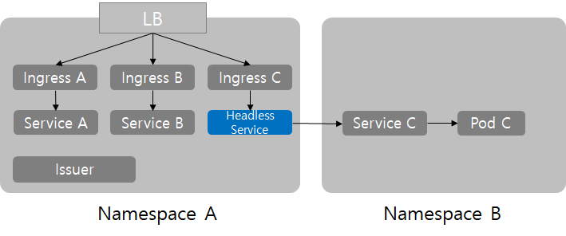

```yaml
같은 namespace에서 다른 namespace의 svc를 바라보고 있는 svc를 배포하여
해당 svc로 ingress를 등록하는 방식.
```

```bash
#--- nginx ingress의 namespace에 headless service 배포
headless-to-minio                        ExternalName   <none>           minio-console.minio.svc.cluster.local   9001/TCP                     3m19s

#--- headless service가 바라보고 있는 namespace와 svc 이름
minio           ClusterIP   10.96.244.122   <none>        9000/TCP   10m
minio-console   ClusterIP   10.96.19.61     <none>        9001/TCP   10m
minio-svc       ClusterIP   None            <none>        9000/TCP   10m

#--- ingress
ceph    nginx   ceph.srrain.kro.kr              80      136m
minio   nginx   minio.srrain.kro.kr             80      6m59s
s3      nginx   s3.srrain.kro.kr                80      138m
```

svc,yaml

```yaml
apiVersion: v1
kind: Service
metadata:
  annotations:
  name: headless-to-minio
  namespace: rook-ceph
spec:
  type: ExternalName
  ports:
    - name: minio-console
      protocol: TCP
      port: 9001
  externalName: minio-console.minio.svc.cluster.local
```

ingress.yaml

```yaml
apiVersion: networking.k8s.io/v1
kind: Ingress
metadata:
  name: minio
  namespace: rook-ceph
  annotations:
    nginx.ingress.kubernetes.io/enable-cors: "true"
    nginx.ingress.kubernetes.io/cors-allow-headers: "X-Forwarded-For"
    nginx.ingress.kubernetes.io/proxy-read-timeout: "120"
spec:
  ingressClassName: nginx
  rules:
    - host: minio.srrain.kro.kr
      http:
        paths:
          - pathType: Prefix
            backend:
              service:
                name: headless-to-minio
                port:
                  number: 9001
            path: /
```