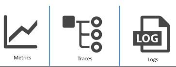

# 그라파나가 수집하는 것

세가지 종류로 모니터링 수집 분류를 나눌 수 있다.

---

### 메트릭

- Node exporter
    - CPU, mem, 네트워크 등 기존 호스트 관련 측정항목 수집
- Kube-state-metrics
    - 클러스터 수준 지표: Pod 지표, 리소스 정보 등
- **Kubernetes control plane metrics**
    - kubelet, etcd, dns, 스케줄러 등

---

### 로그

PLG스택

EFK 스택

---

### 트레이싱

kiali

pinpoint