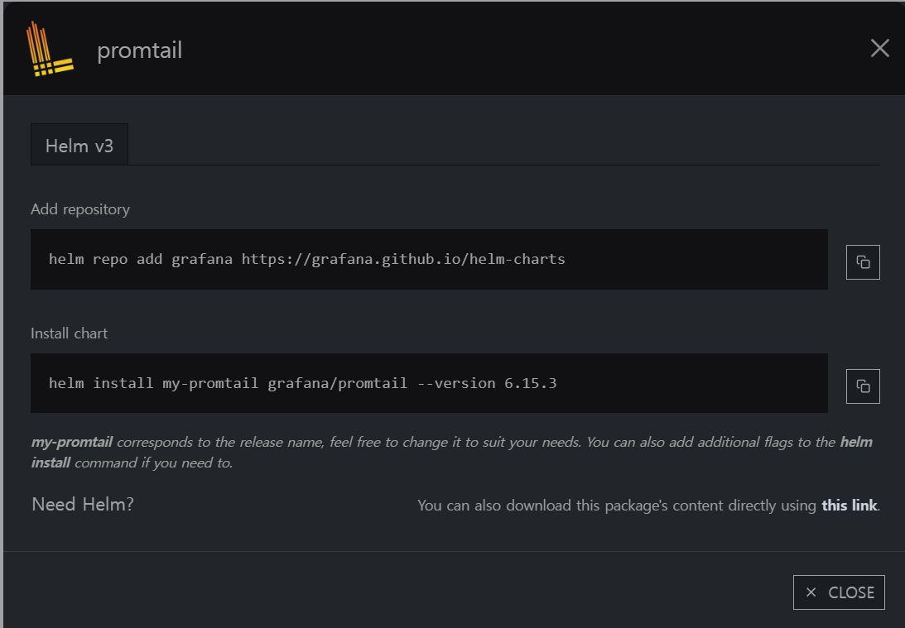
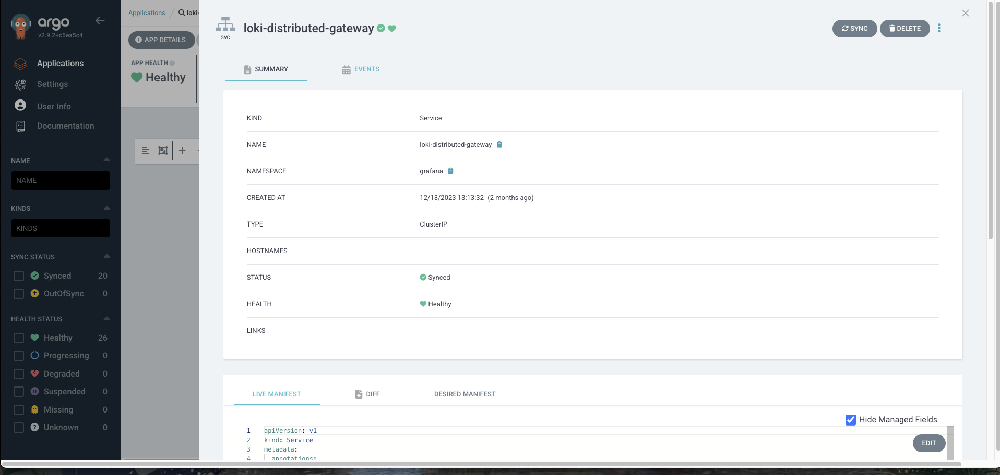

# promtail loki

promtail



values.yaml

```yaml
config:
  clients:
    # loki의 url을 적으면 된다.
    - url: http://loki-distributed-gateway.grafana.svc:80/loki/api/v1/push
  enableTracing: true
  snippets:
    pipelineStages:
      - cri: {}
      #해당하는 네임스페이스 로그는 수집 안 함
      - drop:
          source:     "namespace"
          expression: "(appofapps|argocd|cert-manager|default|gitlab|grafana|jupyter|kube-node-lease|kube-public|kube-system|kubecost|logging|otel|prometheus)"
```

url에 여기 있는 {NAME}.{NAMESPACE}.svc.port 형식으로 적으면 된다.

/loki/api/v1/push는 고정된 RestAPI 주소이다.



---

### **loki-distributed**


values

- 깔끔한 코드
    
    ```yaml
    compactor:
      enabled: true
    loki:
      structuredConfig:
        compactor:
          shared_store: s3
        ingester:
          max_transfer_retries: 0
          chunk_idle_period: 1h
          chunk_target_size: 1536000
          max_chunk_age: 1h
        schema_config:
          configs:
            - from: 2020-09-07
              store: boltdb-shipper
              object_store: s3
              schema: v11
              index:
                prefix: loki_index_
                period: 24h
        storage_config:
          boltdb_shipper:
            shared_store: s3
            active_index_directory: /var/loki/index
            cache_location: /var/loki/cache
            cache_ttl: 168h
          filesystem:
            directory: null
          aws:
            endpoint: https://kr.object.ncloudstorage.com
            region: kr-standard
            bucketnames: logs-loki-dev
            access_key_id: {액세스키 삭제}
            secret_access_key: {시크릿키 삭제}
            s3forcepathstyle: true
            insecure: false
            sse_encryption: false
    ```
    

```yaml
compactor:
  # 파일이 저장될때 한 로그(대충 900바이트?)들이 수많은 파일로 생성되기 보다
  # 하나의 압축파일로 관리하는 오브젝트
  enabled: true
loki:
  structuredConfig:
  # tpl 파일로 설정이 관리되기에 여기서 오버라이드 하는 섹션
    compactor:
      # 압축 관리를 s3에서 하겠다.
      shared_store: s3
    ingester:
      max_transfer_retries: 0
      chunk_idle_period: 1h
      chunk_target_size: 1536000
      max_chunk_age: 1h
    schema_config:
      # schema_config 를 s3로 설정하겠다.
      configs:
        - from: 2020-09-07
          store: boltdb-shipper
          object_store: s3
          schema: v11
          index:
            prefix: loki_index_
            period: 24h
    storage_config:
      # storage_config 를 s3로 설정하겠다.
      boltdb_shipper:
        shared_store: s3
        active_index_directory: /var/loki/index
        cache_location: /var/loki/cache
        cache_ttl: 168h
      filesystem:
        # 자주 보이는 null error 때문에 스택오버플로우에서 filesystem를 안 쓰고 s3만 쓰도록 가이드함
        directory: null
      aws:
        # s3의 옵션, 네이버 클라우드를 사용중이기에 네이버 엔드포인트로 오버라이드
        endpoint: https://kr.object.ncloudstorage.com
        region: kr-standard # 사용중인 리전(네이버는 이거 고정)
        bucketnames: logs-loki-dev # 사용중인 버켓 네임
        access_key_id: {액세스키 삭제} # 키 (네이버는 계정의 키만 됨)
        secret_access_key: {시크릿키 삭제}
        s3forcepathstyle: true # 이 아래는 없어도 될듯? 
        insecure: false
        sse_encryption: false 
```


---

### grafana


loki gateway url에 맞추어서 지정


로그가 수집되는 것을 확인할 수 있음