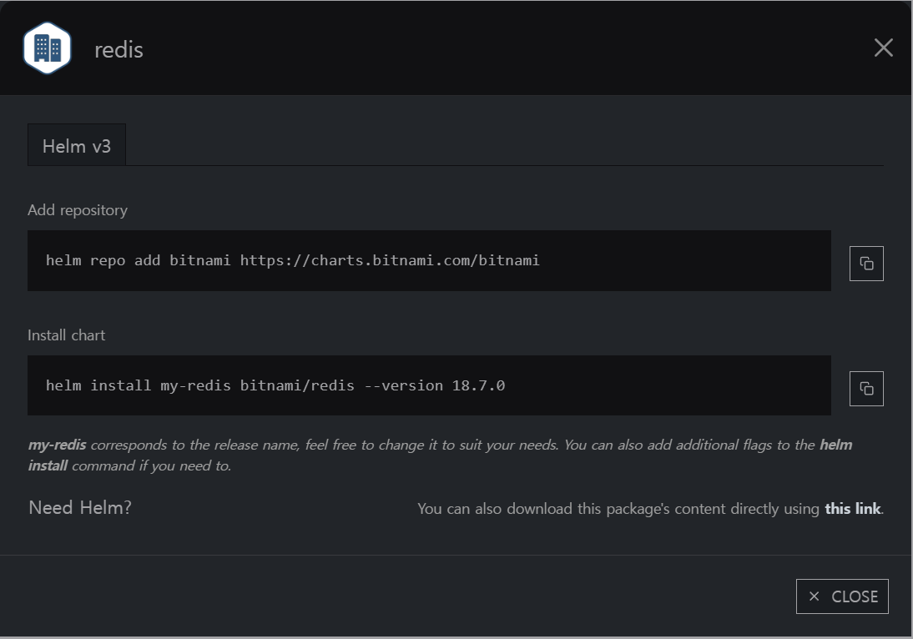

# redis

helm chart info



values.yaml

```yaml
global:
  storageClass: ""
  redis:
    password: "qwer1234"

master:
  persistence:
    size: 10Gi
  resources:
    requests:
      cpu: "500m"
      memory: "1Gi"
    limits:
      cpu: "1"
      memory: "2Gi"

replica:
  persistence:
    size: 10Gi

metrics:
  enabled: true
  serviceMonitor:
    enabled: true
    namespace: prometheus
    interval: 30s
  prometheusRule:
    enabled: true
```

ArgoCD 배포
