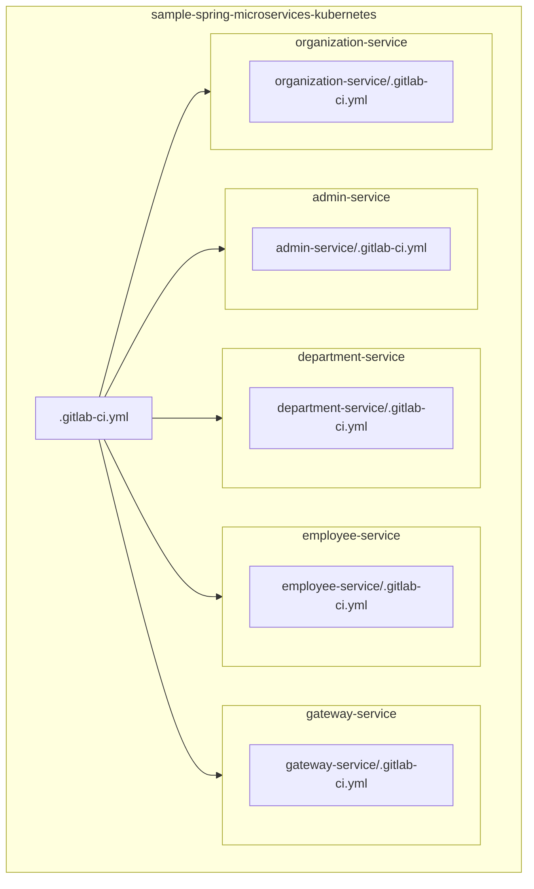
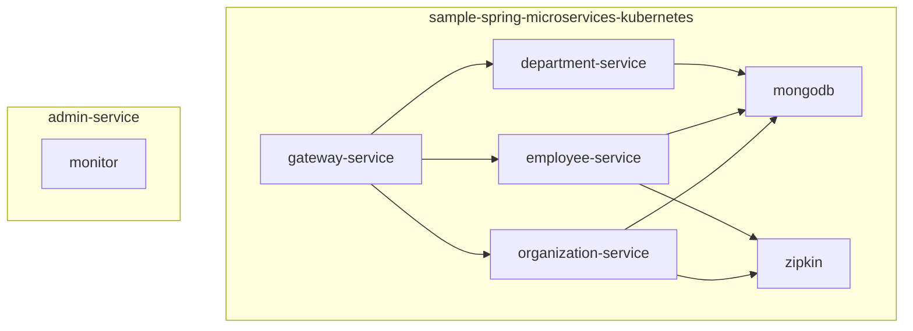

# 구조



# 설명
- 공개되어있는 github의 소스를 가지고 쿠버네티스에 올리는 것 테스트
- 각 폴더마다 최상위 디렉토리 기준으로 테스트하였음.
- 바로 배포하려면 각각 git repo로 생성해야함.(or 경로를 수정)

- gitlab ci 기준으로 각 모듈별에 변경이 생겼을때 CI/CD 가 동작함

- 최상위에 있는 .gitlab-ci.yml이 하위 폴더에 변경 사항이 일어났을 시
- 하위 폴더/.gitlab-ci.yml을 호출
- 해당 ci에 정의되어 있는 stage를 수행함
1. maven build
2. docker build, push
3. helm chart tag change

# sample-spring-microservices-kubernetes 수정사항
- 모듈 별로 CICD가 동작하기에 Dockerfile에  "./employee-service/.....~" 와 같이 각 폴더를 하위폴더로 추가함

* 각 모듈에 디펜던시가 없어서 쿠버네티스의 configmap을 읽어오지 못하여 아래 디펜던시를 추가함
```
<groupId>org.springframework.cloud</groupId>
<artifactId>spring-cloud-starter-bootstrap</artifactId>
```


* 아래 디펜던시가 OpenTelemetry 라이브러리를 불러오기에
```
<groupId>io.micrometer</groupId>
<artifactId>micrometer-tracing-bridge-otel</artifactId>
```

* configmap의 application.properties: 부분에 "spring.zipkin.base-url" 대신  "management.zipkin.tracing.endpoint" 로 추가
```
spring.zipkin.base-url=http://zipkin/ 로 기재 시 url이 적용되지 않음
management.zipkin.tracing.endpoint=http://jarger-jaeger-collector:9411/api/v2/spans   로 바뀐 문법으로 사용
(zipkin이 무거워서 allinone jarger 사용  *서로 호환되는 오픈 소스*)
```

- env 설정:
- 아래의 환경변수 값이 자동으로 같은 이름의 configmap과 secret을 불러오도록 되어있는 것 같음.
- 해당 환경 변수 적용 시 configmap의 mongodb host를 바라보도록 동작이 바뀌었음.
```
env:
  SPRING_CLOUD_BOOTSTRAP_ENABLED: "true"
  SPRING_CLOUD_KUBERNETES_SECRETS_ENABLEAPI: "true"
```


초반에 잘 몰라서 소스코드에서 namespace를 하드코딩으로 수정했는데 pod 생성 시
```
items:
- fieldRef:
    apiVersion: v1
    fieldPath: metadata.namespace
    path: namespace
```
라는 volume mount가 되어 namespace를 긁어오는 설정처럼 보임(디펜던시 라이브러리로 동작하는 거 처럼 보이는데 코딩이 필요할지도?)

 

# sample-spring-microservices-kubernetes-helm 수정사항
- argocd app으로 jaeger helm을 최소 설치로 배포하였음
- helm chart마다 configmap, secret, env를 values.yaml에서 관리할 수 있게 수정하였음

- "gateway"는 ingress path가 여러 개 생성해도 default 설정으로
  - path의 service로 chart의 full name을 가지고 오게 되어있어서
  - ingress.yaml파일에서 service port등을 range 함수로 여러 개를 갖고 오게 변경하였음
    - 기본 chart는 적용 안 함.(필요성을 못 느꼈기에)
> ingress.yaml의 52번째 줄부터 변경사항
```
  service:
    name: {{ $fullName }}
    port:
      number: {{ $svcPort }}
```
↓
```
  service:
    name: {{ .backend.service.name }}
    port:
      number: {{ .backend.service.port.number }}
```      

---
- env 설정:
- deployment.yaml에 range로 적용하도록 바꾼 코드
```
  env:          
    {{- range $key, $val := .Values.env }}
      - name: {{ $key }}
        value: {{ $val | quote }}
    {{- end }}
```

- mongodb의 경우는 env가 키: 밸류가 아닌 kubernetes 리소스를 참조하는 방식이므로
- values.yaml에서 관리할 수 있도록 values.yaml의 텍스트를 그대로 긁어오는 문법을 사용하였음
```
  env:
    {{- toYaml . | nindent 12 }}
```

# 문제점
- ClusterRole에 최소 권한만 줘야하는데 처음에 문제가 많이 발생해서 디버깅점 줄일려고 모든 권한을 주었음
- 필요한 쿠버네티스 리소스는 mongodb chart에 넣어서 mongodb 배포시 clusterrole, binding, serviceaccount, imagepullsecret를 생성하도록 만들었음


# 번외로 argocd로 helm chart 배포하기
- argocd-infra-component로 다룬 적이 있지만 바로 helm chart.yaml을 만들어서 apply 하는 방식이 생각보다 까다로웠다.
- argocd ui에서 repo 추가로 helm chart를 추가하고
- app 생성할때 자동 생성되는 값들을 참조하여 app-helm을 배포하고
- 해당 app을 yaml로 빼내니까 parameter로 값을 수정하지 않고 오버라이드 -f values.yaml 과 같은 방식으로 추출되었다.

- argocd에서 helm chart를 관리시 helm list에는 이력이 남진 않지만
- ui로 리소스를 보고 쉽게 log를 볼 수 있고, 재사용이 편한 점이 있어서 
- 개인적으론 여러 사이트에 구축하려면 이런 식으로 관리해도 좋을 것 같다.

- 그리고 istio도 같은 식으로 argocd에 보이게 배포하여 테스트해 볼 예정이다.
- VirtualService, gateway등이 눈으로 보일테니 istio 관리가 많이 쉬워질 것으로 예상한다.
