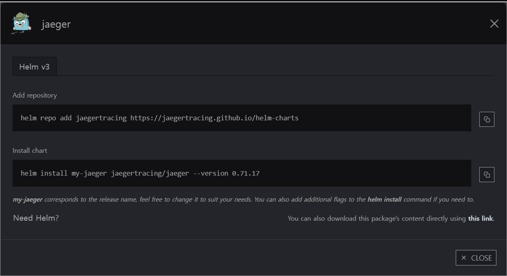

# Jaeger

### Jaeger



Helm Repo  add https://jaegertracing.github.io/helm-charts 

Jaeger Helm 올인원 모드 config values 값

```
provisionDataStore:
  cassandra: false
allInOne:
  enabled: true
  ingress:
    enabled: true
    ingressClassName: gitlab-nginx
    hosts:
      - jaeger.srrain.kro.kr
    labels:
      app: jaeger
    pathType: Prefix
storage:
  type: none
agent:
  enabled: false
collector:
  enabled: false
query:
  enabled: false
```

Spring boot에서 필요한 Dependency

```bash
# -- 스프링에서 쿠버네티스 제공 서비스를 연계하는 디펜던시
<dependency>
    <groupId>org.springframework.cloud</groupId>
    <artifactId>spring-cloud-starter-kubernetes-fabric8-all</artifactId>
</dependency>

# -- tracing을 코드에 추가하는 디펜던시
# -- 아래 디펜던시를 추가하면 zipkin url을 spring에 꼭 추가해야지 동작이 성공한다.
# management.zipkin.tracing.endpoint=http://jaeger-collector:9411/api/v2/spans
# configmap에 deployment와 같은 이름으로 application.properties 를 생성시 자동으로 로딩하는 것처럼 보임.
<dependency> 
    <groupId>io.opentelemetry</groupId>
    <artifactId>opentelemetry-exporter-zipkin</artifactId>
</dependency>
```

사용한 Configmap

```yaml
apiVersion: v1
data:
  application.properties: >-
    spring.data.mongodb.host: mongodb-spring
    spring.data.mongodb.database: admin
    spring.data.mongodb.authentication-database: admin

    management.zipkin.tracing.endpoint=http://jarger-jaeger-collector:9411/api/v2/spans
    management.tracing.sampling.probability=1.0
kind: ConfigMap
metadata:
  name: employee
  namespace: springcloud
```

Jaeger와 Zipkin을 모두 설치해봤는데 Zipkin이 좀 더 무겁고 Jaeger 좀 더 쿠버네티스에 맞게 개발이 진행된 것처럼 느껴졌다.

두 솔루션은 호환 가능한 Tracing 솔루션이다.

Zipkin url: 에 Jaeger를 적어도 거의 완벽 호환되어 작동한다.
