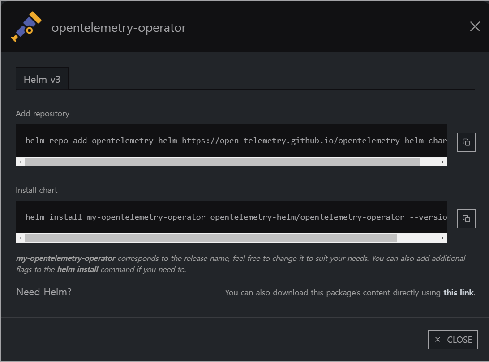

# OpenTelemetry for k8s

https://opentelemetry.io/docs/kubernetes/operator/

쿠버네티스의 Operator를 사용해 CRD를 기반으로 

Collector와(로그 보관) 

Instrumentation(로그 서빙?) tracing을 구성하는 방법이다.

먼저 opentelemetry-operator 를 배포한다.

```jsx
helm repo add opentelemetry-helm https://open-telemetry.github.io/opentelemetry-helm-charts
helm install opentelemetry-operator opentelemetry-helm/opentelemetry-operator --version 0.43.1
```



argocd로 배포하였다.


이제 OpenTelemetryCollector를 생성해야 하는데, CRD로 생성할 시 어떠한 오브젝트가 생성되는지 보이지 않는 게 불편하여 CRD도 argocd로 배포하였다


python-**instrumentation**이 side car로 로그를 Collector에 서빙하는 컴포넌트인데 

이게 추적할 서비스의 namespace마다 하나씩 필요하다!  (약간 namespace 기준 daemonset 느낌?)

namespace에 없을 경우 annotations을 적어놔도 init container가 안 붙는다

**OpenTelemetryCollector**은 하나만 있으면 된다.

```yaml
apiVersion: opentelemetry.io/v1alpha1
kind: OpenTelemetryCollector
metadata:
  name: my-collector
spec:
  mode: deployment
  #mode: sidecar #사이드 카도 되고 디플로이먼트도 되고 스테이터스풀셋도됨
  config: |
    receivers:
      otlp:
        protocols:
          grpc: # on port 4317 자동 맵핑 포트
          http: # on port 4318 

      fluentforward:
        endpoint: 0.0.0.0:8006 # ??모르겠네 왜 쓰지..?

    processors:
      batch: # 배치에 들어가는 기능들이 기본 기능으로 생성됨

      resource: # 로키의 attribute를 다시 레이블링
        attributes:
        - action: insert
          key: service_name
          from_attribute: service.name
        - action: insert
          key: service_namespace
          from_attribute: service.namespace
        - action: insert
          key: compose_service
          from_attribute: compose_service
        - action: insert
          key: loki.resource.labels
          value: service_name, service_namespace, compose_service

    exporters: # 수집한 로그를 어디로 또 포워딩 할 것인지 정하는 섹션
      logging:
        #loglevel: debug # 이제 미지원하는 설정 verbosity로 변경
        verbosity: detailed
      # traces
      otlp/tempo:
        endpoint: http://tempo.grafana.svc:4317 # tempo에 grpc로 연결 시도
        tls:
          insecure: true
          #insecure_skip_verify: true
      # logs
      loki:
        endpoint: http://loki-distributed-gateway.grafana.svc/loki/api/v1/push # loki에 연결 시도

    extensions: # 확장 기능 활성화
			#예를 들어 수집기 상태 모니터링, 서비스 검색, 데이터 전달 등을 위한 확장을 추가할 수 있습니다.
      health_check:
      pprof:
      zpages:

    service:
      extensions: [health_check, pprof, zpages] # 확장 기능 활성화
      pipelines:
        traces:
          receivers: [otlp] # 선언한 리시버에서 수집할 것이고
          processors: [batch] # 프로세싱 단계로 가공할 것이고
          exporters: [logging, otlp/tempo] # 위에 선언한 otlp/tempo로 포워딩 할 것임.
        logs:
          receivers: [otlp]
          processors: [resource]
          exporters: [logging, loki] #logging이 console에 출력하는 설정
```

Instrumentation 로그 서빙

```yaml
apiVersion: opentelemetry.io/v1alpha1
kind: Instrumentation
metadata:
  name: pp-instrumentation
spec:
  exporter:
		# 위에서   name: my-collector 으로 만든 것에 -collector가 더 붙음.
		# 다른 namespace에 생성했다면 http://my-collector-collector.namespace.svc:4318 
    endpoint: http://my-collector-collector:4318 
  env:
  propagators: # 로그를 어떤 형식으로 가공해서 수집할 것인지
    - tracecontext
    - baggage
  sampler: # 로그 수집 설정
    type: parentbased_traceidratio
    argument: "1" # 모두 수집
  python: # 파이썬 자동 추적일때 추가할 변수 -> pod에 추가됨
    env:
      - name: OTEL_LOGS_EXPORTER # 로그의 타입 설정
        value: otlp_proto_http
      - name: OTEL_PYTHON_LOGGING_AUTO_INSTRUMENTATION_ENABLED # pod에 자동 추적 활성화
        value: 'true'
```

propagators 섹션에 사용 가능한 변수

```jsx
Using Environment Variables
You can set the OTEL_PROPAGATORS environment variable with a comma-separated list. Accepted values are:

"tracecontext": W3C Trace Context
"baggage": W3C Baggage
"b3": B3 Single
"b3multi": B3 Multi
"jaeger": Jaeger
"xray": AWS X-Ray (third party)
"ottrace": OT Trace (third party)
"none": No automatically configured propagator.
```

sampler에 사용 가능한 변수(불확실)

```jsx
"always_on": AlwaysOnSampler
"always_off": AlwaysOffSampler
"traceidratio": TraceIdRatioBased
"parentbased_always_on": ParentBased(root=AlwaysOnSampler)
"parentbased_always_off": ParentBased(root=AlwaysOffSampler)
"parentbased_traceidratio": ParentBased(root=TraceIdRatioBased)
"parentbased_jaeger_remote": ParentBased(root=JaegerRemoteSampler)
"jaeger_remote": JaegerRemoteSampler
"xray": AWS X-Ray Centralized Sampling (third party)
```

auto inject를 하기 위해 pod의 annotations에 주석을 추가한다.

deployment 기준으로는 spec.template.metadata.annotations: 에 추가하면 된다.

혹은 namespace에 추가도 가능하다고 한다.(안 해봄)


```yaml
#어떤 언어를 추적할 것인지에 대한 주석
.NET: 
	instrumentation.opentelemetry.io/inject-dotnet: "true"
Go: 
	instrumentation.opentelemetry.io/inject-go: "true"
Java: 
	instrumentation.opentelemetry.io/inject-java: "true"
Node.js: 
	instrumentation.opentelemetry.io/inject-nodejs: "true"
Python: 
	instrumentation.opentelemetry.io/inject-python: "true"

#sidecar 방식일 때 inject 대상으로 타겟팅 주석
sidecar.opentelemetry.io/inject: 'true'
```

```yaml
#사담 
opentelemetry 도커부분에서 적용해둔 변수들이 그대로 적용되는 것 처럼 보인다
그래서 이전에 사용한 변수때문에 자꾸 host 주소가 없는 곳을 바라보고 있어 실패했었다.
```

grafana에서 tempo와 연결을 설정한다.


정상적으로 추적이 되었을 때 grafana에서 service name에 등록되어 목록으로 나타난다.


쿼리를 클릭해보면 tracing 정보가 나타난다.


jaeger와도 동일한 방법으로 연동 가능하고 동시에 이중으로 export도 가능.

정상적으로 연결이 됐을 경우 init 컨테이너와 생성한 컨테이너에 환경 변수가 추가됨


추가된 환경 변수 OTEL_SERVICE_NAME은 직접 정의한 이름


---

### +++ 추가 변경사항

instrumentation의 설정 값을 fastapi 기준으로 이렇게 변경하였음


```bash
propagators:
  - tracecontext
  - baggage
sampler:
  type: parentbased_traceidratio
  argument: "1"
python:
  env:
    OTEL_PYTHON_LOGGING_AUTO_INSTRUMENTATION_ENABLED: 'true'
    # OTEL_EXPORTER_OTLP_METRICS_PROTOCOL: none
    OTEL_EXPORTER_OTLP_LOGS_PROTOCOL: http/protobuf
    OTEL_EXPORTER_OTLP_TRACES_PROTOCOL: http/protobuf
    OTEL_EXPORTER_OTLP_ENDPOINT: 'http://otel-collector.otel.svc:4318'

#-- 환경변수 방식이 2개
    # OTEL_LOGS_EXPORTER: otlp
    OTEL_METRICS_EXPORTER: none      #404 not found 
    OTEL_PYTHON_LOG_CORRELATION: 'true'
```

OTEL_EXPORTER_OTLP_METRICS_PROTOCOL: none 는 none이라는 value값이 없어서

OTEL_METRICS_EXPORTER: none  를 사용함

none을 사용한 이유는 메트릭은 프로메테우스로 전부 긁어오고 있어서

receivers를 설정하지 않았기에 메트릭을 내보낼 시 404 not found 가 로그에 쌓여서 비활성화 처리