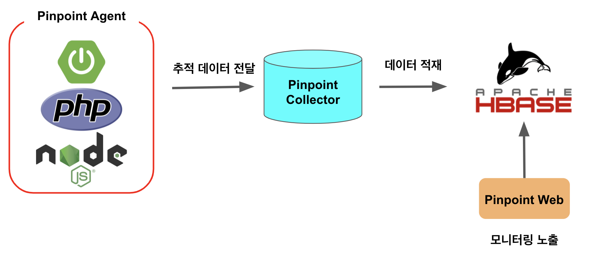

# PinPoint

pinpoint는 상용 소프트웨어인 제니퍼와 같은 종류의 코드 수준을 추적 모니터링하는

네이버에서 만든 오픈소스 트레이싱 도구이다.

헬름 공유 사이트인 아티팩트 허브에 헬름 차트가 없는 관계로

github에 어떤 분이 올려두신 yaml을 활용해서 쿠버네티스에 서버를 띄어보았다.

https://github.com/veverita7/pinpoint-kubernetes.git

핀포인트의 구조는 에이전트가 콜렉터로 정보를 전달하고 정보를 저장하는 데에 HBase가 사용된다.



필요한 yaml 추가하여 argocd로 배포하였다

https://github.com/sRrAiN98/Kubernetes/tree/main/tracing/pinpoint-web

pinpoint를 연결할 ex_deployment.yaml 를 생성하였고

pinpoint agent 파일을 mount하기 위한 ex_pv_pvc.yaml를 추가하였다.

pinpoint를 초기 실행하면 아무 것도 없다. 


아래 installation 페이지에서 agent 파일 다운로드와, jvm 실행 인수를 복사할 수 있다.


jvm args에 필요한 내용을 복사하여 java_opts에 추가하면 agent가 실행될 때 해당 내용으로 config를 load한다.


pv를 hostpath로 설정하여 내 컴퓨터에 받아온 에이전트를 압축해제하여 풀어놓았다


deployment에 pvc를 mount한다.


deployment env에 pinpoint config값을 설정하여 jvm이 실행될 때 해당 옵션을 불러온다.

```bash
env:
  - name: JAVA_TOOL_OPTIONS
    value: >-
        -javaagent:/pinpoint/pinpoint-bootstrap-2.5.2.jar # 핀포인트 에이전트실행
        -Dpinpoint.config=/pinpoint/pinpoint-root.config # 핀포인트 설정 값 불러오기
        -Dpinpoint.applicationName=banner -Dpinpoint.agentName=banner # 핀포인트에 등록할 이름
        -Dprofiler.transport.grpc.collector.ip=pinpoint-collector.pinpoint.svc.cluster.local # service이름.namespace만 적어도 해당하는 ip를 쿠버네티스의 coredns로 찾아감
        -Dpinpoint.profiler.profiles.active: dev # 무슨 프로파일로 활성화 할 것이냐
        -Dprofiler.sampling.percent.sampling-rate=20 # 어느정도 비율로 수집할 것이냐
        -Dpinpoint.container 
```

jvm이 pinpoint agent를 로딩해온 모습


pinpoint에 등록된 모습


