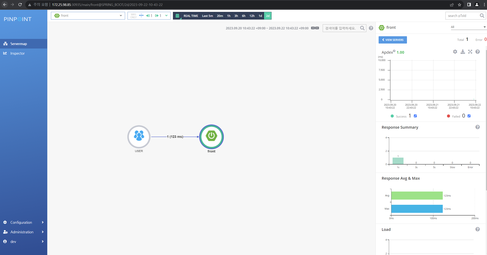
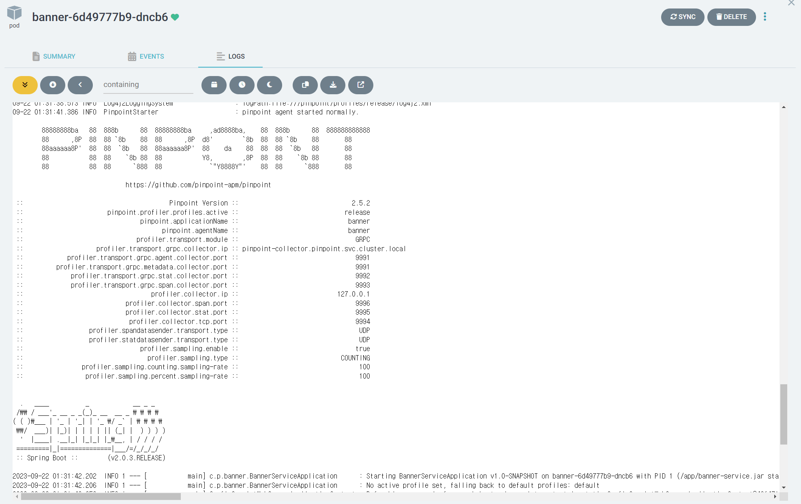

# pinpoint - kubernetes
yaml은 helm chart가 artifacthub에 없는 관계로 github에 어떤 분이 올려놓으신 yaml파일을 사용했다.
출처: https://github.com/pinpoint-apm/pinpoint-kubernetes.git



java실행할때 javaagent 인수를 추가하여 apm 에이전트가 실행되는 방식이고
JAVA OPTS는 env를 활용하여 git과 argo에서 관리하기 쉽게 구성하였다.

로컬환경에서 실행한 관계로 hostpath를 활용한 방법과
pv를 만들고 pv 안에 직접 pinpoint를 cp로 복사하여 pv를 재사용하는 방식으로 활용하였다.

pv는 간단하게 cli를 활용해서 테스트 한 관계로 gitops의 argocd에 추가하지 않고
kubectl apply -f pv_pvc.yaml -n appofapps 
명령어를 사용하여 테스트를 진행하였다.

pinpoint-root.config에 pinpoint server ip정보를 기재한다.

혹은 JAVA OPTS에 오버라이드하여 적용할 수 있다.
```
env:
  - name: JAVA_TOOL_OPTIONS
    value: >-
        -Dprofiler.transport.grpc.collector.ip=pinpoint-collector.pinpoint.svc.cluster.local ## kube coredns
        -Dpinpoint.profiler.profiles.active: dev
        -Dprofiler.sampling.percent.sampling-rate=20
```




1. pv, pvc 생성
2. pv에 pinpoint를 kubectl cp로 추가
3. deployment의 /pinpoint에 mount하여 JAVA OPTS로 정보 추가