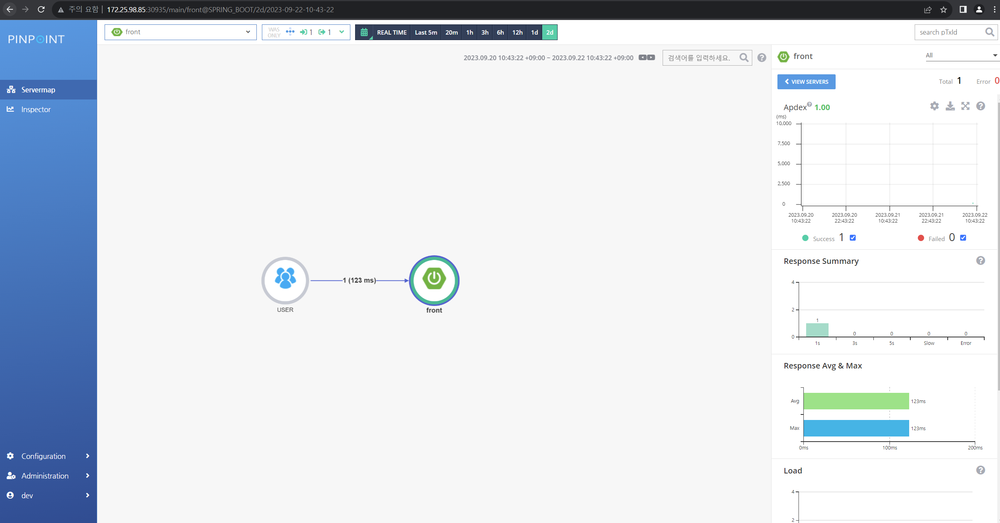
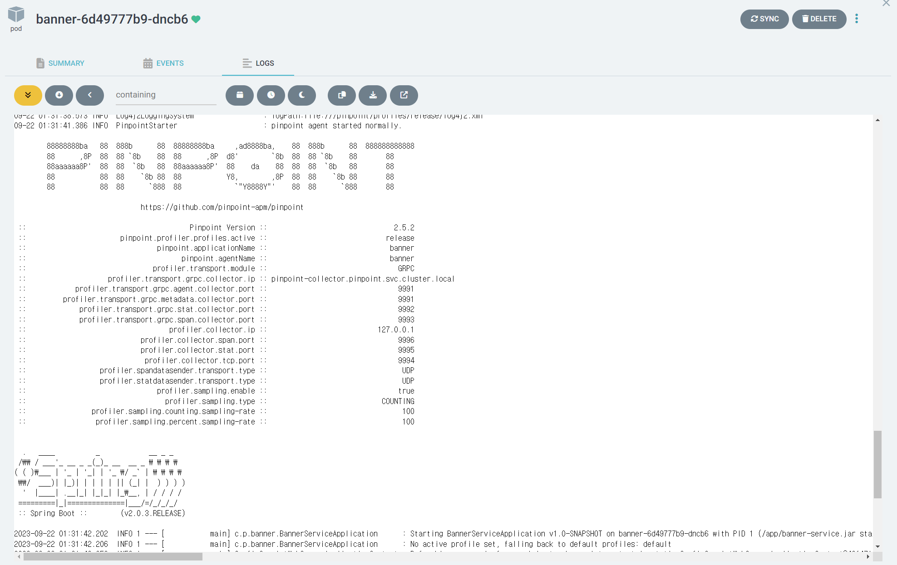

# pinpoint - kubernetes
yaml은 helm chart가 artifacthub에 없는 관계로 github에 어떤 분이 올려놓으신 yaml파일을 사용했다.
출처: https://github.com/veverita7/pinpoint-kubernetes.git



java실행할때 javaagent 인수를 추가하여 apm 에이전트가 실행되는 방식이고
JAVA OPTS는 env를 활용하여 git과 argo에서 관리하기 쉽게 구성하였다.

로컬환경에서 실행한 관계로 hostpath를 활용한 방법과
pv를 만들고 pv 안에 직접 pinpoint를 cp로 복사하여 pv를 재사용하는 방식으로 활용하였다.

pv는 간단하게 cli를 활용해서 테스트 한 관계로 gitops의 argocd에 추가하지 않고
kubectl apply -f pv_pvc.yaml -n appofapps 
명령어를 사용하여 테스트를 진행하였다.

pinpoint-root.config에 pinpoint server ip정보를 기재한다.

혹은 JAVA OPTS에 오버라이드하여 적용할 수 있다.
```
env:
  - name: JAVA_TOOL_OPTIONS
    value: >-
        -Dprofiler.transport.grpc.collector.ip=pinpoint-collector.pinpoint.svc.cluster.local ## kube coredns
        -Dpinpoint.profiler.profiles.active: dev
        -Dprofiler.sampling.percent.sampling-rate=20
```




1. pv, pvc 생성
2. pv에 pinpoint를 kubectl cp로 추가
3. deployment의 /pinpoint에 mount하여 JAVA OPTS로 정보 추가


--- 추가내용
# PinPoint

핀포인트의 구조는 에이전트가 콜렉터로 정보를 전달하고 정보를 저장하는 데에 HBase가 사용된다.


필요한 yaml 추가하여 argocd로 배포하였다

pinpoint를 연결할 ex_deployment.yaml 를 생성하였고

pinpoint agent 파일을 mount하기 위한 ex_pv_pvc.yaml를 추가하였다.

pinpoint를 초기 실행하면 아무 것도 없다. 


아래 installation 페이지에서 agent 파일 다운로드와, jvm 실행 인수를 복사할 수 있다.


jvm args에 필요한 내용을 복사하여 java_opts에 추가하면 agent가 실행될 때 해당 내용으로 config를 load한다.


pv를 hostpath로 설정하여 내 컴퓨터에 받아온 에이전트를 압축해제하여 풀어놓았다


deployment에 pvc를 mount한다.


deployment env에 pinpoint config값을 설정하여 jvm이 실행될 때 해당 옵션을 불러온다.

```bash
env:
  - name: JAVA_TOOL_OPTIONS
    value: >-
        -javaagent:/pinpoint/pinpoint-bootstrap-2.5.2.jar # 핀포인트 에이전트실행
        -Dpinpoint.config=/pinpoint/pinpoint-root.config # 핀포인트 설정 값 불러오기
        -Dpinpoint.applicationName=banner -Dpinpoint.agentName=banner # 핀포인트에 등록할 이름
        -Dprofiler.transport.grpc.collector.ip=pinpoint-collector.pinpoint.svc.cluster.local # service이름.namespace만 적어도 해당하는 ip를 쿠버네티스의 coredns로 찾아감
        -Dpinpoint.profiler.profiles.active: dev # 무슨 프로파일로 활성화 할 것이냐
        -Dprofiler.sampling.percent.sampling-rate=20 # 어느정도 비율로 수집할 것이냐
        -Dpinpoint.container 
```

jvm이 pinpoint agent를 로딩해온 모습


pinpoint에 등록된 모습
