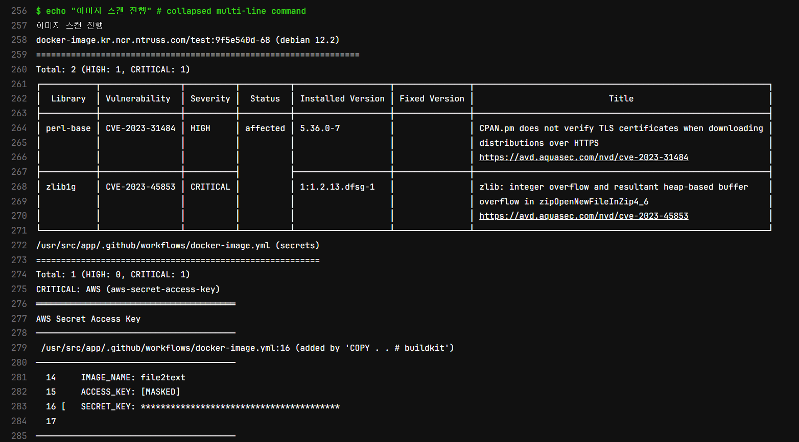

느낀 점은 JAVA DB 다운로드만 500MB니까

DB다 다운 받은 이미지를 재사용 하는 게 좋을 것 같음

서버가 필요 없이 Client 바이너리 하나만으로 이미지 검사가 가능하고

trivy가 Kubernetes 현재 보안 상태도 검사할 수 있음

Gitlab에서 report를 보려면 유료 버전을 사용해야기에

Critical만 따로 가져와서 다른 레포에 넣고 리포트를 관리하고

Slack으로 알람을 뿌리던지 해야할 것 같음

Gitlab_CI

```bash
stages: 
  - docker

docker:
  image: docker:stable-dind
  stage: docker
  variables:
    DOCKERFILE_PATH: "./Dockerfile"
    CI_REGISTRY: "docker-image.kr.ncr.ntruss.com"
    APP_NAME: "test"
    TRIVY_VERSION: "0.47.0"
  before_script: # docker.sock 로딩 대기
    - until docker info; do sleep 1; done
  script:
    - |
      echo "도커 로그인"
      echo ${SECRET_KEY} | docker login -u ${ACCESS_KEY} --password-stdin ${CI_REGISTRY}

    - |
      echo "태그 설정"
      NEW_TAG=${CI_COMMIT_SHORT_SHA}-${CI_PIPELINE_ID}

    - |
      echo "도커 이미지 빌드 & 푸시"
      docker build -t ${CI_REGISTRY}/${APP_NAME}:${NEW_TAG} .

    - |
      echo "curl 다운로드"
      apk add --no-cache curl 

    - |
      echo "trivy 다운로드"
      curl -sfL https://raw.githubusercontent.com/aquasecurity/trivy/main/contrib/install.sh | sh -s -- -b /usr/local/bin v${TRIVY_VERSION}

    - |
      echo "gitlab security 템플릿 다운로드" # 엔터프라이즈 기능...
      curl https://raw.githubusercontent.com/aquasecurity/trivy/main/contrib/gitlab.tpl -o gitlab.tpl

    - |
      echo "이미지 스캔 진행"
      trivy image --cache-dir .trivycache/ ${CI_REGISTRY}/${APP_NAME}:${NEW_TAG} -s HIGH,CRITICAL --exit-code 0 --quiet
      trivy image --cache-dir .trivycache/ ${CI_REGISTRY}/${APP_NAME}:${NEW_TAG} --format template --template "@./gitlab.tpl" -o gl-container-scanning-report.json  --exit-code 0 > /dev/null 2>&1

    - |
      echo "로컬 도커 이미지 삭제"
      docker rmi ${CI_REGISTRY}/${APP_NAME}:${NEW_TAG} --force
  after_script:
    - docker images
  artifacts: 
    paths: 
      - gl-container-scanning-report.json
    reports: # 엔터프라이즈 기능....
      container_scanning: gl-container-scanning-report.json
  rules:
    - if: '$CI_COMMIT_BRANCH == "main"'
      when: always
```
