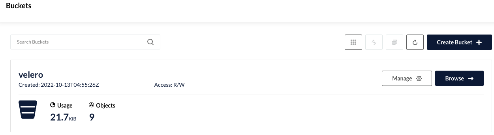

# velero + minio local install

#minio helm 

```yaml
helm repo add minio-official https://charts.min.io
helm install minio minio-official/minio -n minio --create-namespace
```

# 유저 이름 4글자 이상 && 패스워드 8자 이상, pv 미부착(테스트용)

vim custom.yaml 

```yaml
replicas: 3
 
minioAPIPort: "32000"
minioConsolePort: "32001"
 
rootUser: admin
rootPassword: qwer12341
 
persistence:
  enabled: false
 
resources:
  requests:
    memory: 1Gi
 
service:
  type: NodePort
  port: "32000"
 
consoleService:
  type: NodePort
  port: "32001"
port: "32001"
```

#설치

```bash
helm install -n minio minio -f custom.yaml minio/minio
```

#minio에 접속해서 bucket: velero를 생성(velero helm에 명시될 bucket name)



---

#nodeport로 열려있지만 clusterip의 port로 명시(pod내에서 서로 접속하는 것)

#name: default 무조건 default여야함 버그 있음 소스 코드 내에 하드코딩 되어있음

#minio는 S3랑 호환 스토리지

vim custom.yaml

```yaml
initContainers:
  - name: velero-plugin-for-aws
    image: velero/velero-plugin-for-aws:v1.5.1
    imagePullPolicy: IfNotPresent
    volumeMounts:
      - mountPath: /target
        name: plugins

configuration:
  provider: aws
  backupStorageLocation:
    name: default
    bucket: velero
    config:
      region: minio
      s3ForcePathStyle: true
      publicUrl: http://minio.backup.svc:9000
      s3Url: http://minio.backup.svc:9000

credentials:
  useSecret: true
  secretContents:
    cloud: |
      [default]
      aws_access_key_id = admin
      aws_secret_access_key = qwer12341

snapshotsEnabled: false
deployRestic: true

restic:
  resources:
    requests:
      cpu: 500m
      memory: 256Mi
    limits:
      cpu: 1000m
```

```bash
helm install -n backup velero -f custom.yaml  vmware-tanzu/velero
```

#minio - velero 연결 확인

```bash
k get [backupstoragelocations.velero.io](http://backupstoragelocations.velero.io/) -A
```

https://github.com/vmware-tanzu/velero/releases/에서 velero cli tools 다운 받아서 사용

#명령어 사용 예시

```bash
#mac 기준
wget https://github.com/vmware-tanzu/velero/releases/download/v1.9.2/velero-v1.9.2-darwin-amd64.tar.gz
tar -zxvf velero-v1.9.2-darwin-amd64.tar.gz
cd velero-v1.9.2-darwin-amd64
./velero backup create nginx-backup1 --namespace backup --include-namespaces nginx-example
```

#minio에 저장되는 것을 확인
